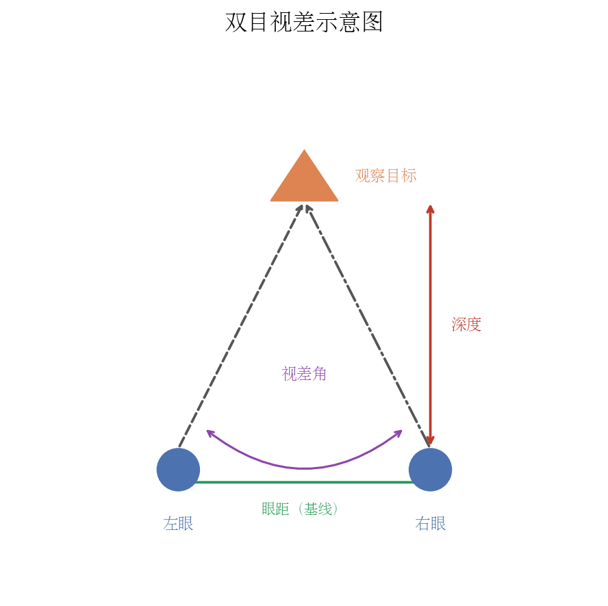
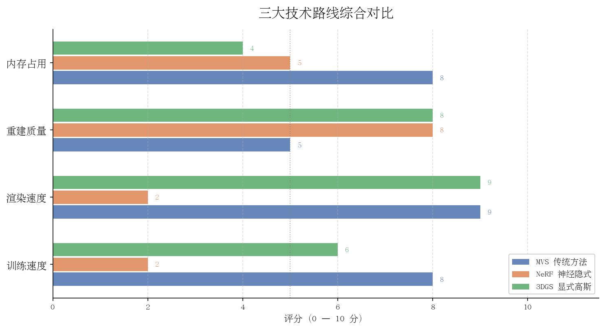
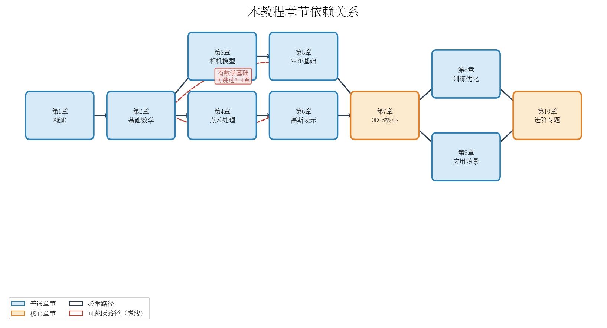

# 第一章：三维重建是什么，为什么重要

> 从一张普通照片出发，建立对三维重建全局的直觉认知。

---

## 1.1 从一张照片说起

### 人眼如何感知深度

闭上你的右眼，只用左眼看着面前的一支铅笔。再闭上左眼，只用右眼看。你会发现铅笔相对于背景发生了"跳动"——这就是**双目视差**（Binocular Parallax）的直观体现。

人的两只眼睛相距约 6.5 厘米，各自从略微不同的角度看世界。大脑将两幅图像融合，通过计算视差量来推断物体的远近。越近的物体，左右眼图像中该物体的位置偏移越大；越远的物体，偏移越小。这套机制叫做**立体视觉**（Stereo Vision），可以用简单的几何关系来描述：

$$
Z = \frac{f \cdot B}{d}
$$

其中 $Z$ 是物体深度，$f$ 是相机焦距，$B$ 是双目基线距离（两眼间距），$d$ 是视差（左右图像中对应点的水平位移）。深度与视差成反比——这正是近处物体"跳动"更明显的根本原因。



除了双目视差，人眼还依赖许多**单目深度线索**来感知空间：

- **遮挡关系**：近处物体会遮挡远处物体，被遮挡的一定更远
- **相对大小**：已知尺寸的物体，越远看起来越小
- **纹理梯度**：地面砖块或草地，越远纹理越密集
- **运动视差**：头部移动时，近处物体移动快，远处物体移动慢
- **大气透视**：远处景物颜色更偏蓝、对比度更低

人脑综合所有这些线索，构建出连续的、稳定的三维世界感知。这种能力如此自然，以至于我们很少意识到它背后的复杂计算。

### 照片丢失了什么

一张普通的照片是一次**投影变换**的结果：三维世界中的每个点 $(X, Y, Z)$ 被相机的光学系统投影到二维像素平面 $(u, v)$ 上。这个过程由**针孔相机模型**（Pinhole Camera Model）描述：

$$
\begin{bmatrix} u \\ v \\ 1 \end{bmatrix} \sim K \begin{bmatrix} R \mid t \end{bmatrix} \begin{bmatrix} X \\ Y \\ Z \\ 1 \end{bmatrix}
$$

其中 $K$ 是**相机内参矩阵**（焦距、主点），$R$ 和 $t$ 是**相机外参**（旋转和平移，描述相机在世界中的位置和朝向）。

这个投影是**不可逆的**。已知像素坐标 $(u, v)$，无法唯一确定它在三维空间中的位置，因为沿光线方向上的所有点都会映射到同一像素。用通俗的话说：

> **深度信息 $Z$ 在拍照的瞬间永远地消失了。**

这就是三维重建问题的核心挑战：我们拥有的只是二维投影，却想恢复三维世界。多视角图像提供了解决这一问题的钥匙——从不同位置拍摄同一场景，就像人的两只眼睛，通过视差关系重新推断深度。

> **思考题 1.1**：站在笔直的铁路上向远处望，铁轨越远越收拢，最终在地平线交于一点（灭点）。这属于哪种深度线索？如果只给你这张铁路照片，你能准确计算铁轨真实间距随距离如何变化吗？如果不能，还需要什么额外信息？

---

## 1.2 三维重建的定义与目标

### 问题的形式化定义

**三维重建**（3D Reconstruction）的任务可以简洁地定义为：

> 给定同一场景从不同角度拍摄的多张图像 $\{I_1, I_2, \ldots, I_N\}$，以及可选的相机参数，输出一个**可渲染的三维模型**，使得从任意新视角渲染该模型，都与真实场景在视觉上高度一致。

注意这个定义的两个关键词：

- **多视角（Multi-view）**：单张图像的深度信息已丢失，多张图像通过视差提供几何约束，使深度可被恢复
- **可渲染（Renderable）**：不只是三维点云或网格，而是能从任意视角合成照片级别的图像

### 输入与输出

| 阶段 | 内容 | 典型规模 |
| ------ | ------ | --------- |
| **输入** | 多视角 RGB 图像，可选深度图、相机位姿 | 数十至数千张 |
| **中间表示** | 三维结构（点云、网格、体素、神经场、高斯椭球…） | 视方法而定 |
| **输出** | 新视角合成图像（Novel View Synthesis, NVS） | 任意分辨率 |

### 评价指标的直觉解释

重建质量通过对比渲染图像与真实图像来衡量。主流使用三个指标，各自从不同角度衡量"像不像"：

---

#### PSNR（Peak Signal-to-Noise Ratio，峰值信噪比）

$$
\text{PSNR} = 10 \cdot \log_{10} \left( \frac{\text{MAX}^2}{\text{MSE}} \right), \quad \text{MSE} = \frac{1}{HW} \sum_{i=1}^{H}\sum_{j=1}^{W} \left(I(i,j) - \hat{I}(i,j)\right)^2
$$

其中 $\text{MAX}=255$（8 位图像），$I$ 是真实图像，$\hat{I}$ 是渲染图像。

**直觉**：PSNR 越高越好，单位是分贝（dB）。通常 30 dB 以上表示质量不错，35 dB 以上较好，40 dB 以上接近无损。**局限**：它只看逐像素差异，对人眼感知不敏感。例如图像整体平移一个像素，MSE 会很大，但人眼几乎感知不到。

---

#### SSIM（Structural Similarity Index，结构相似性指数）

$$
\text{SSIM}(x, y) = \frac{(2\mu_x\mu_y + c_1)(2\sigma_{xy} + c_2)}{(\mu_x^2 + \mu_y^2 + c_1)(\sigma_x^2 + \sigma_y^2 + c_2)}
$$

其中 $\mu_x, \mu_y$ 是局部均值，$\sigma_x^2, \sigma_y^2$ 是局部方差，$\sigma_{xy}$ 是协方差，$c_1, c_2$ 是稳定常数。

**直觉**：SSIM 取值范围 $[0, 1]$，越接近 1 越好。它同时考量**亮度**（均值比较）、**对比度**（方差比较）、**结构**（协方差比较）三个维度，比 PSNR 更贴近人眼对"结构完整性"的感知。你可以把它理解为：在每个局部小窗口内，两幅图像看起来有多相似。

---

#### LPIPS（Learned Perceptual Image Patch Similarity，学习感知图像相似性）

$$
\text{LPIPS}(x, y) = \sum_{l} \frac{1}{H_l W_l} \sum_{h,w} \left\| w_l \odot \left(\hat{\phi}_l^x - \hat{\phi}_l^y\right) \right\|_2^2
$$

其中 $\phi_l^x$ 是预训练深度网络（如 VGG、AlexNet）第 $l$ 层对图像 $x$ 的特征图，$w_l$ 是可学习的通道权重，$\odot$ 是逐元素乘法。

**直觉**：LPIPS 越低越好（最低为 0）。它在深度网络的特征空间中度量距离，而神经网络天然学会了对纹理、边缘、语义等人眼敏感的特征做出响应。因此 LPIPS 是目前**最接近人类主观感知**的客观指标，已成为新视角合成任务的标准评估工具。

---

#### 三个指标的直觉对比小结

| 指标 | 方向 | 直觉类比 | 主要局限 |
| ------ | ------ | --------- | --------- |
| PSNR | 越高越好（dB） | 像素级"差多少" | 不符合人眼感知 |
| SSIM | 越高越好（0~1） | 局部"看起来像不像" | 对语义错误不敏感 |
| LPIPS | 越低越好（0~1） | 人脑"感觉像不像" | 需要预训练模型，计算稍慢 |

> **思考题 1.2**：假设重建系统输出的图像整体比真实图像亮了 20%（相当于在后处理中调高了亮度）。这种系统性偏差会如何分别影响 PSNR、SSIM、LPIPS 的得分？哪个指标对这种全局亮度偏移最不敏感，为什么？

---

## 1.3 主流技术路线全景

三维重建领域在过去二十年经历了从传统几何方法、到基于深度学习的隐式表达、再到显式神经渲染的跨越式发展。当前主流有三条技术路线，各有侧重、各有擅场。



### 路线一：MVS 传统多视图立体几何

**多视图立体（Multi-View Stereo, MVS）** 是计算机视觉的经典方向，已有三十年历史。典型流程如下：

1. **特征提取与匹配**：用 SIFT、ORB 等算子在各图像中检测关键点，跨图匹配同名点
2. **运动恢复结构（Structure from Motion, SfM）**：从匹配点恢复相机位姿和稀疏三维点云
3. **稠密深度估计（MVS）**：对每张图像计算稠密深度图
4. **点云融合与表面重建**：将所有深度图融合为完整三维点云，再拟合网格

代表工具：COLMAP（SfM + MVS 一体化）、OpenMVG、PMVS/CMVS。

**优势**：流程清晰可解释，无需大量训练数据，在有纹理的场景中速度快、精度好。

**局限**：依赖纹理（纯色墙面等无特征区域几乎无法重建）；不支持反光、透明材质；输出的点云或网格渲染质量远不如照片真实感。

---

### 路线二：NeRF 神经辐射场（隐式表达）

**神经辐射场（Neural Radiance Field, NeRF）** 于 2020 年由 Mildenhall 等人提出，引发了三维重建领域的革命。核心思想是用一个多层感知机（MLP）隐式编码整个场景：

$$
F_\theta: (\mathbf{x}, \mathbf{d}) \longrightarrow (\mathbf{c}, \sigma)
$$

输入空间坐标 $\mathbf{x} = (x, y, z)$ 和视线方向 $\mathbf{d} = (\theta, \phi)$，输出该点的颜色 $\mathbf{c} = (r, g, b)$ 和体密度 $\sigma \geq 0$。

渲染时，沿视线方向对颜色和密度进行体积积分：

$$
\hat{C}(\mathbf{r}) = \int_{t_n}^{t_f} T(t)\, \sigma\bigl(\mathbf{r}(t)\bigr)\, \mathbf{c}\bigl(\mathbf{r}(t), \mathbf{d}\bigr)\, dt, \quad T(t) = \exp\!\left(-\int_{t_n}^{t} \sigma\bigl(\mathbf{r}(s)\bigr)\, ds\right)
$$

其中 $T(t)$ 是从近平面到 $t$ 处的累积透射率（表示光线"还没被遮挡"的概率），$\mathbf{r}(t) = \mathbf{o} + t\mathbf{d}$ 是光线上 $t$ 处的点。

**优势**：渲染质量极高，能处理复杂光照，在有限数量图像下效果优异。

**局限**：训练慢（原版需数小时，Instant-NGP 等加速版仍需数分钟到数十分钟）；推理极慢（每帧需要对数万条光线各自积分，原版远低于 1 FPS）；场景表示隐式，难以编辑和修改。

---

### 路线三：3DGS 三维高斯溅射（显式表达）

**三维高斯溅射（3D Gaussian Splatting, 3DGS）** 于 2023 年由 Kerbl 等人提出，在渲染质量和速度上同时取得了突破。核心思想是用大量**三维高斯椭球**显式表示场景：

- 每个高斯有位置 $\boldsymbol{\mu}$（均值）、形状 $\Sigma$（协方差矩阵）、颜色（球谐系数）、不透明度 $\alpha$ 等属性
- 渲染时将三维高斯投影到二维图像平面（解析公式），按深度排序后执行 $\alpha$-blending（"泼溅" Splatting）
- 整个渲染过程高度可并行，在现代 GPU 上可轻松达到 100+ FPS

**优势**：训练速度比 NeRF 快一个数量级（30-60 分钟），渲染完全实时，质量媲美 NeRF。

**局限**：存储开销大（数百万高斯的参数占数百 MB 至 1 GB）；几何表面精度不如传统 MVS；对动态场景、透明材质支持有限。

---

### 三种路线横向对比

| 维度 | MVS 传统方法 | NeRF 神经隐式 | 3DGS 显式高斯 |
| ------ | :-----------: | :------------: | :------------: |
| **表示形式** | 点云 / 网格 | 隐式神经网络 | 显式高斯椭球 |
| **训练时间** | 分钟级 | 数小时（加速版数十分钟） | 30–60 分钟 |
| **渲染速度** | 视管线而定 | 极慢（<1 FPS） | 实时（>100 FPS） |
| **渲染质量** | 中等 | 极高 | 极高 |
| **存储占用** | 小～中 | 小（模型仅数十 MB） | 大（数百 MB～1 GB） |
| **可编辑性** | 高（直接操作几何） | 低（隐式难编辑） | 中（可操作椭球） |
| **动态场景** | 基本不支持 | 有扩展研究 | 有扩展研究 |
| **透明 / 反射** | 困难 | 部分支持 | 有限 |
| **无纹理区域** | 困难（缺特征点） | 较好 | 较好 |
| **开源生态** | 成熟（COLMAP 等） | 成熟（NeRFStudio 等） | 快速发展中 |

> **思考题 1.3**：一个 VR 应用需要用户戴上头显实时漫游一个被重建的古建筑场景，要求帧率不低于 72 FPS，延迟不超过 20 ms。根据对比表，你会优先选择哪种技术路线？在选定方向后，你预判会遇到哪个最棘手的挑战？

---

## 1.4 3DGS 能做什么，不能做什么

本教程以 3DGS 为核心。在深入学习之前，先建立一个清醒的能力边界认知——知道一个工具的上限与下限，才能在实际应用中做出正确决策。

### 3DGS 擅长的场景

**实时渲染** 是 3DGS 最核心的优势。由于高斯椭球是显式的，渲染完全在 GPU 光栅化管线中完成，现代显卡（如 RTX 3090）上可轻松达到 100+ FPS，甚至手机端也有优化实现。这使它非常适合：

- **VR / AR 内容制作**：将真实场景重建后，在 Meta Quest、Apple Vision Pro 等头显中实时漫游
- **影视虚拟制片**：快速重建拍摄现场，供导演实时预览任意机位
- **文化遗产数字化**：古建筑、文物的高质量三维存档与公众展示
- **游戏场景资产**：扫描真实环境后直接用作游戏背景，大幅降低美术成本
- **电商 3D 展示**：产品多角度高质量展示

**室内外静态场景** 是 3DGS 目前最成熟的应用域。在有充足训练视角的条件下（通常 50–300 张图），室内房间、建筑立面、庭院街道等都能取得接近 NeRF 甚至更好的视觉效果。

---

### 3DGS 的局限

**动态物体** 是原始 3DGS 最明显的局限。训练时假设场景完全静止——如果训练图像中有移动的人、飘动的旗帜、流动的水，高斯优化会尝试"平均"所有时刻的外观，产生模糊或"鬼影"（ghost artifact）。虽然已有 Dynamic 3DGS、4D Gaussians 等扩展研究，但在本教程范围内，我们主要处理静态场景。

**透明和反射材质** 是视角依赖外观（non-Lambertian）的挑战。3DGS 使用球谐函数（Spherical Harmonics, SH）建模视角依赖颜色，对简单的漫反射和弱高光有一定效果，但复杂的玻璃折射、水面反射、金属镜面等效果仍然困难。

**大幅度视角外推** 暴露了 3DGS 的本质局限：它是插值，而非理解。如果测试视角大幅偏离训练视角（如俯视变仰视），质量会急剧下降，出现"浮游椭球"（floater）和空洞。

**无纹理大平面** 导致 SfM 初始化困难。纯白墙面、光滑地板等区域特征点稀疏，初始稀疏点云不足，高斯椭球会分布不均、形态失真。

**精确几何提取** 仍是难题。高斯椭球是体积基元，从它们中提取精确的三角网格（如用于 3D 打印或工程测量）需要额外的后处理步骤，精度不如传统 MVS。

---

### 能力边界总结

| 场景类型 | 3DGS 效果 | 备注 |
| --------- | :--------: | ------ |
| 室内静态场景 | 优秀 | 最成熟的应用场景 |
| 室外建筑立面 | 优秀 | 注意控制天空区域 |
| 有限范围室外场景 | 良好 | 大场景需分块处理 |
| 动态物体 | 差 | 需 4D Gaussians 等扩展 |
| 透明 / 玻璃 | 一般 | 基础效果可接受，复杂不行 |
| 镜面反射金属 | 差 | 需 Relightable 3DGS 等方法 |
| 大范围无边界场景 | 一般 | 需 CityGaussian 等方案 |
| 精确几何（测量级） | 差 | 建议用 MVS / LiDAR |

> **思考题 1.4**：假设你想用 3DGS 重建一个养鱼的玻璃鱼缸（鱼缸里有游动的鱼、玻璃缸壁、水面波纹、五彩鱼），你会同时遇到哪几种局限？如果只能先解决一种局限，你会优先攻克哪个，为什么？

---

## 1.5 学习路线与本教程结构

### 整体章节安排

本教程共十章，从基础原理到工程实践，循序渐进：

```text
    ↓
第二章：相机模型与坐标变换
    ↓
第三章：特征提取与相机位姿估计（SfM / COLMAP）
    ↓
第四章：三维高斯表示——从点到椭球
    ↓
第五章：可微渲染与 Splatting 算法
    ↓
第六章：3DGS 训练流程与损失函数
    ↓
第七章：自适应密度控制（Densification）
    ↓
第八章：工程实现——从零复现 3DGS
    ↓
第九章：进阶专题（动态、大场景、压缩）
    ↓
第十章：应用实战（VR 漫游、场景编辑）
```



### 各章依赖关系说明

- **第一章**（本章）是全局概览，无前置依赖，适合直接开始
- **第二章** 建立相机数学基础，是后续所有章节的基石；需要基础线性代数（矩阵乘法、齐次坐标）
- **第三章** 依赖第二章的相机模型，介绍如何从图像自动获取相机位姿
- **第四、五章** 是 3DGS 的核心理论，互相紧密关联；第四章讲"是什么"，第五章讲"如何渲染"
- **第六、七章** 是训练细节，依赖第四、五章；第七章的密度控制是理解 3DGS 效果的关键
- **第八章** 是代码实现，依赖前七章所有内容；此章结束后你可以独立运行完整的 3DGS
- **第九、十章** 是扩展阅读，依赖第八章，可按兴趣选读

### 推荐学习节奏

| 读者背景 | 建议路线 | 预计时间 |
| --------- | --------- | --------- |
| **快速了解 3DGS** | 第 1、3（简读）、5（简读）、8 章 | 1 周 |
| **系统学习，零基础** | 按顺序全部章节，每章配合思考题 | 4–6 周 |
| **有 NeRF 基础** | 第 1–2 章快读，第 4–8 章精读 | 2–3 周 |
| **研究入门** | 全部章节 + 每章末推荐论文 | 6–8 周 |

### 前置知识要求

本教程面向**有编程基础的本科生**，建议具备：

- **Python 编程**：能看懂 for 循环、函数定义、类的基本用法（不需要高级特性）
- **线性代数基础**：矩阵乘法、向量内积、行列式的概念——忘了也没关系，第二章会系统复习
- **微积分基础**：偏导数和链式法则的概念——用于理解反向传播，第六章会重温
- **命令行基础**：能在终端运行 `pip install`、执行 Python 脚本

**不需要提前具备**：PyTorch / TensorFlow 经验（本书会介绍必要用法）、计算机图形学知识、CUDA / GPU 编程、NeRF 或 MVS 基础。

**关于数学**：本教程的策略是"直觉优先，公式辅助"——每个公式出现时，都会先用日常语言解释它在做什么，再给出数学形式。如果你看公式头疼，可以先读文字部分，之后再回来理解数学细节。

> **思考题 1.5**：回顾你自己的知识背景，上面列出的前置知识中，哪一项对你来说最薄弱？在进入第二章之前，你计划用什么资源来补足它？（推荐：线性代数可参考 3Blue1Brown 的《线性代数的本质》系列视频；Python 可参考官方 Tutorial）

---

## 本章小结

本章为整个教程奠定了背景认知基础，核心要点如下：

1. **深度感知的本质**：人眼通过双目视差（公式 $Z = fB/d$）和多种单目线索感知三维空间；照片是三维到二维的投影，深度信息不可逆地丢失，这是三维重建问题存在的根本原因。

2. **三维重建的定义**：输入多视角图像，输出可渲染的三维模型（新视角合成）。质量评价三指标：PSNR 衡量像素级误差（越高越好），SSIM 衡量结构相似性（越高越好），LPIPS 最贴近人眼感知（越低越好）。

3. **技术路线全景**：MVS 传统方法成熟但渲染质量有限；NeRF 渲染质量极高但速度极慢；3DGS 用显式高斯椭球在质量与速度之间取得最佳平衡，支持实时渲染（>100 FPS）。

4. **3DGS 的能力边界**：擅长静态场景的高质量实时渲染，在室内外静态场景中表现优秀；对动态物体、透明反射材质、大幅视角外推等情况有明显局限，使用前需清醒评估场景是否适合。

5. **学习路线**：本教程十章构成从原理到实现的完整闭环。零基础读者建议按顺序学习，有基础的读者可按章节依赖关系跳读。每章末的思考题是检验理解深度的好工具，不要略过。

从下一章开始，我们将进入相机模型的数学世界，为后续的三维几何推导打下坚实基础。

---

## 推荐阅读

- Kerbl 等，"3D Gaussian Splatting for Real-Time Radiance Field Rendering"，SIGGRAPH 2023。[arXiv:2308.04079](https://arxiv.org/abs/2308.04079)
- Mildenhall 等，"NeRF: Representing Scenes as Neural Radiance Fields for View Synthesis"，ECCV 2020。[arXiv:2003.08934](https://arxiv.org/abs/2003.08934)
- Schönberger & Frahm，"Structure-from-Motion Revisited"，CVPR 2016。（COLMAP 论文）
- Hugging Face 博客：[A Comprehensive Overview of 3D Gaussian Splatting](https://huggingface.co/blog/gaussian-splatting)

---

*下一章：[第二章：相机模型与坐标变换](chapter2.md)*
