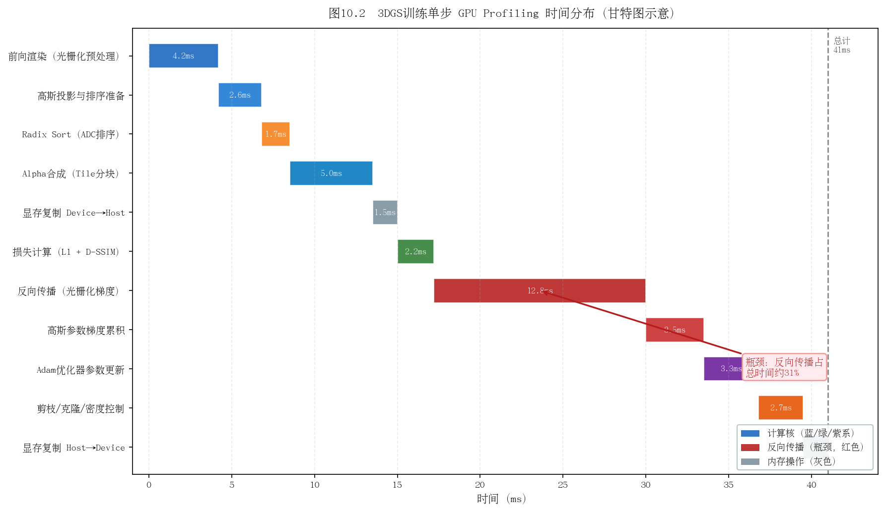
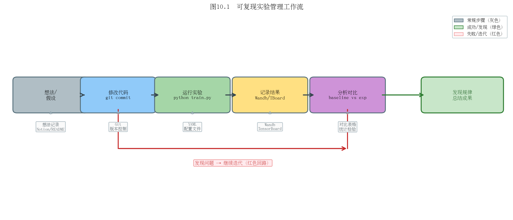
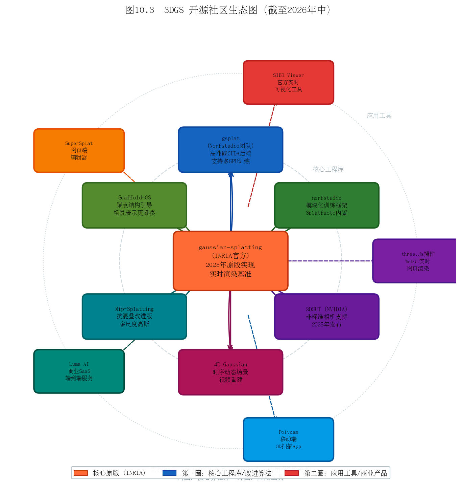

# 第十章：成为贡献者——如何迭代改进系统

> 读懂代码只是起点。本章讲如何在3DGS基础上做出真正的贡献。

---

## 10.1 建立可复现的实验基线

### 可复现性是一切的前提

在改进任何系统之前，首先要有一个**可靠、可复现的基线（Baseline）**。听起来简单，但实践中大量时间都浪费在"我不确定这次结果变好了是因为我的改动还是随机性"。

**建立基线的工程规范：**

```
project/
├── configs/
│   ├── base_config.yaml    # 所有实验共享的默认参数
│   └── exp_001_lr_tuning.yaml  # 实验特定的参数覆盖
├── runs/
│   ├── baseline_garden_20240601/  # 每次运行用日期+描述命名
│   └── exp_001_garden_20240605/
├── results/
│   └── comparison_table.csv    # 所有实验结果汇总
└── scripts/
    └── run_baseline.sh
```

**使用 Hydra 管理配置：**

```yaml
# base_config.yaml
model:
  sh_degree: 3
  iterations: 30000
training:
  densify_grad_threshold: 0.0002
  lambda_dssim: 0.2
dataset:
  path: data/garden
  resolution: 1
```

**版本控制原则：**

1. 每个实验前打一个 git tag（`git tag exp_001_lr_tuning`）
2. 实验配置文件进 git
3. 实验结果不进 git（用 DVC 或 Wandb 管理大文件）
4. commit message 写清楚"什么改动、为什么改、预期效果"

**统一随机种子：**

```python
import random, numpy as np, torch
def seed_everything(seed=42):
    random.seed(seed)
    np.random.seed(seed)
    torch.manual_seed(seed)
    torch.cuda.manual_seed_all(seed)
```

**思考题**：两次使用相同参数训练同一场景，PSNR 相差 0.3 dB。这个差异是"随机性"还是"真实差异"？如何设计实验来区分？（提示：多次运行取平均，计算标准差）

---

## 10.2 定位性能瓶颈

### CUDA Profiling

在修改代码之前，先**测量**，不要猜测瓶颈在哪里。

**Nsight Systems（NVIDIA，最全面）：**

```bash
# 记录 CUDA 时间线
nsys profile -o profile_output python train.py -s data/garden --iterations 100

# 用图形界面分析
nsys-ui profile_output.nsys-rep
```

**PyTorch Profiler（集成方便）：**

```python
from torch.profiler import profile, ProfilerActivity, tensorboard_trace_handler

with profile(
    activities=[ProfilerActivity.CPU, ProfilerActivity.CUDA],
    on_trace_ready=tensorboard_trace_handler('./log/profiler'),
    record_shapes=True,
    with_stack=True
) as prof:
    # 运行几步训练
    for i in range(10):
        train_one_step()

print(prof.key_averages().table(sort_by="cuda_time_total", row_limit=20))
```

**典型3DGS各阶段时间占比（30k迭代，室内场景）：**

| 阶段 | 时间占比 |
|------|---------|
| 前向渲染（CUDA光栅化） | ~45% |
| 反向传播 | ~40% |
| ADC（排序+剪枝） | ~5% |
| 数据加载 | ~5% |
| 其他 | ~5% |

前向+反向占85%，是性能优化的主战场。

### 内存带宽 vs 计算瓶颈

现代GPU的计算能力（TFLOPS）通常远大于内存带宽（GB/s）。判断瓶颈类型：

- **计算瓶颈（Compute-bound）**：GPU利用率高（>90%），修改算法减少浮点操作
- **内存带宽瓶颈（Memory-bound）**：GPU利用率低，大量时间在等数据。解决方案：提高数据局部性（共享内存）、减少全局内存访问

3DGS 的排序（Radix Sort）是典型的内存带宽瓶颈；光栅化核心（Alpha合成）接近计算瓶颈。



**思考题**：gsplat 相比官方实现在内存占用上减少了约30%。查阅 gsplat 的 release notes，找出主要的内存优化是在哪里实现的？

---

## 10.3 修改高斯基元的正确姿势

### 添加新属性

假设你要给每个高斯添加一个**语义标签**（整数类别ID），步骤如下：

**1. 在 GaussianModel 中添加参数：**

```python
# scene/gaussian_model.py

class GaussianModel:
    def __init__(self, sh_degree):
        # ... 原有参数 ...
        self._semantic_label = torch.empty(0)  # 新增语义标签

    def create_from_pcd(self, pcd, spatial_lr_scale):
        # ... 原有初始化 ...
        # 初始化为0（未知类别）
        self._semantic_label = torch.zeros(
            (fused_point_cloud.shape[0],), dtype=torch.long
        ).to(device)

    @property
    def get_semantic_label(self):
        return self._semantic_label
```

**2. 在 PLY 保存/加载中添加对应字段：**

```python
def save_ply(self, path):
    # 原有字段保存 ...
    semantic = self._semantic_label.cpu().numpy().astype(np.uint8)
    # 加入到 elements 列表
```

**3. 如果需要可微，加入 optimizer：**

```python
def training_setup(self, training_args):
    l = [
        # ... 原有参数组 ...
        {'params': [self._semantic_label], 'lr': 0.001, "name": "semantic"}
    ]
    self.optimizer = torch.optim.Adam(l, lr=0.0)
```

### 修改梯度流

如果要修改反向传播中梯度的计算方式（比如加入梯度裁剪或自定义梯度），需要了解3DGS梯度流的关键路径：

```
渲染损失 L
  └─→ 渲染图像 I_hat
       └─→ CUDA光栅化器（前向/反向）
            └─→ 各高斯的 2D 贡献（μ', Σ', α, c）
                 └─→ 球谐系数 f（颜色梯度）
                 └─→ 不透明度 o（不透明度梯度）
                 └─→ 协方差 Σ（形状梯度）
                      └─→ 旋转 q 和缩放 s
                 └─→ 位置 μ（位置梯度）
```

**CUDA 扩展的修改：** 如需修改光栅化本身（如加入深度平滑正则化），需要修改 `backward.cu`，这需要 CUDA 编程基础。推荐先阅读 gsplat 的实现（代码更清晰），再参考修改。

**思考题**：你想给高斯添加"法线向量"属性，并在训练中加入法线一致性损失。法线向量的梯度会影响哪些参数？需要修改 `backward.cu` 吗？

---

## 10.4 替代库：gsplat 与 nerfstudio

### gsplat：高性能 3DGS 后端

[gsplat](https://github.com/nerfstudio-project/gsplat) 是 Nerfstudio 团队开发的3DGS后端，已成为社区最广泛使用的替代实现。

**优势：**
- 内存效率：比官方实现低约30%内存占用
- API清晰：Python优先，更易于自定义扩展
- 活跃维护：修复官方实现的已知bug
- 支持非标准相机：鱼眼、全景相机

```python
# gsplat 的核心 API
from gsplat import rasterization

renders, alphas, info = rasterization(
    means=means3D,
    quats=rotations,
    scales=scales,
    opacities=opacities,
    colors=colors,
    viewmats=viewmats,
    Ks=intrinsics,
    width=W, height=H,
    render_mode="RGB+D",  # 同时渲染颜色和深度
)
```

### nerfstudio：模块化训练框架

[nerfstudio](https://github.com/nerfstudio-project/nerfstudio) 提供了一套完整的NeRF/3DGS训练框架，内置 **Splatfacto**（3DGS实现）。

优势：统一的实验管理、内置可视化、配置系统完善。

```bash
# 安装 nerfstudio
pip install nerfstudio

# 用 Splatfacto（3DGS）训练
ns-train splatfacto --data data/garden/

# 实时可视化
ns-viewer --load-config outputs/.../config.yml
```

### Gaussian Opacity Fields（GOF）

GOF 用**不透明度场**替代显式alpha，允许从高斯场中提取精确的等值面（网格）。适合需要精确几何的任务。

```python
# GOF 的核心思想：高斯贡献的不透明度场
def opacity_field(x, gaussians):
    contributions = []
    for g in gaussians:
        # 每个高斯的不透明度贡献
        d = x - g.mu
        contrib = g.alpha * exp(-0.5 * d.T @ inv(g.Sigma) @ d)
        contributions.append(contrib)
    return sum(contributions)  # 可用于Marching Cubes
```

### 3DGUT：通用非结构化相机

**3DGUT**（NVIDIA 2025，[arXiv:2312.02121](https://arxiv.org/abs/2312.02121)）扩展3DGS支持任意相机模型（鱼眼、全景、车载广角）。工业数据集（如自动驾驶）通常使用非标准相机，3DGUT是处理这类数据的重要工具。

**思考题**：nerfstudio 的 Splatfacto 和原版 gaussian-splatting 仓库在 PSNR 上有微小差异。查阅 nerfstudio 的文档，找出两者实现上的主要差异（初始化方式？损失函数？优化器设置？）

---

## 10.5 消融实验设计

消融实验（Ablation Study）是证明你的改进"真实有效"的核心手段。

### 控制变量原则

每次只改**一个**变量：

```
实验A：基准（原版3DGS）
实验B：加入你的改进X，其他一切不变
实验C：加入你的改进Y，其他一切不变  
实验D：同时加入X和Y
```

比较 A→B→C→D 的结果，才能分离每个改进的贡献。

### 指标选取

- **通用NVS指标**：PSNR / SSIM / LPIPS（必须报告）
- **任务特定指标**：几何任务加Chamfer Distance；SLAM任务加ATE（绝对轨迹误差）；分割任务加mIoU
- **效率指标**：训练时间、渲染FPS、显存占用、模型大小

**不要只报告最好的数字**——应在多个数据集上测试，报告平均值和标准差。

### 统计显著性

3DGS训练有随机性（Adam的随机性、初始化随机性），同一配置多次运行结果会有波动。

**建议：** 至少运行3次，报告均值±标准差：

```
我们的方法在garden场景上PSNR为27.8±0.2 dB，
基准为27.4±0.2 dB，提升0.4 dB，t检验p<0.05，统计显著。
```

如果PSNR提升只有0.1 dB但方差是0.3 dB，提升就**不显著**。

**思考题**：你提出了一个改进X，在5个场景中，3个场景PSNR提升，2个场景下降。这个改进是"成功"的吗？如何在论文中诚实地报告这个结果？

---

## 10.6 开源与投稿建议

### 顶会截止日期（2024-2026年参考）

| 会议 | 论文截止（通常） | 通知时间 | 举办时间 |
|------|--------------|---------|---------|
| CVPR | 11月 | 2月 | 6月 |
| ICCV | 3月 | 7月 | 10月（奇数年） |
| ECCV | 3月 | 7月 | 10月（偶数年） |
| SIGGRAPH | 1月 | 4月 | 8月 |
| NeurIPS | 5月 | 9月 | 12月 |
| ICLR | 10月 | 1月 | 5月 |

**建议优先投 arXiv**（不管是否投顶会），让社区尽早看到你的工作，收集反馈。

### 代码整洁度标准

开源代码是第二份"论文"，质量直接影响引用量：

```
✓ 有详细的 README（安装、数据集、训练、测试命令）
✓ 有 requirements.txt 或 environment.yaml
✓ 核心逻辑有简短注释（但不要过度注释）
✓ 提供预训练模型（供快速复现）
✓ 有 demo 脚本（5行代码跑通基本功能）
✗ 避免 hardcode 路径（用 argparse 或 config）
✗ 避免未使用的 import 和注释掉的代码
```

### README 写法

好的 README 结构：

```markdown
# 论文标题

[论文链接] [项目主页] [视频演示] [引用BibTeX]

## 效果展示（放最好的图）

## 安装

## 快速开始（3步跑通demo）

## 训练

## 评估

## 预训练模型下载
```

### 社区协作

- **Issue**：用户反馈的bug及时回复（<7天），是口碑的关键
- **Pull Request**：接受合理的改进PR，注明贡献者
- **Discussion**：参与3DGS相关的 Discord（如 [3DGS Discord](https://discord.gg/3dgs)）和 Twitter 讨论

**思考题**：你的论文被顶会接收了，但代码还没准备好开源。应该在接收通知后多久内开源代码？不开源会有什么影响？

---

## 10.7 推荐学习资源汇总

### 论文阅读路径（建议顺序）

**入门必读（按顺序）：**

1. NeRF (2020) — 理解体渲染和可微渲染
2. Instant-NGP (2022) — 了解加速NeRF的思路
3. 3DGS (2023) — 核心论文，反复读
4. Scaffold-GS (2024) — 了解一种主流改进方向
5. 2DGS (2024) — 了解几何改进方向

**进阶精读（按兴趣选择）：**

- 压缩方向：LightGaussian、Mini-Splatting
- 动态场景：4D Gaussians、Deformable 3DGS
- 语义理解：Gaussian Grouping、Feature 3DGS
- 工业应用：HUGSIM、DrivingGaussian

### 精选课程

| 课程 | 平台 | 特点 |
|------|------|------|
| Stanford CS231A | YouTube | 相机几何权威教程 |
| CMU 16-385 | YouTube | 完整计算机视觉 |
| Fast.ai Practical Deep Learning | fast.ai | 最实用的深度学习入门 |
| Nerfstudio Workshop | YouTube | 3DGS工程实践 |

### 活跃研究组（关注他们的论文）

| 研究组 | 机构 | 代表工作 |
|-------|------|---------|
| INRIA GraphDeco | 法国国家信息研究院 | 原版3DGS |
| Nerfstudio团队 | UC Berkeley | gsplat, nerfstudio |
| 汤晓鸥团队 | 商汤/CUHK | GaussianAvatars, SuGaR |
| Christian Theobalt团队 | MPI | Relightable 3DGS |
| 陈宝权团队 | 北京大学 | VastGaussian, CityGaussian |
| Qianqian Wang | Cornell | 4D Gaussians |

### 中文社区

- **知乎专栏**：搜索"3DGS"，有大量中文解读和入门教程
- **B站**：多个UP主有3DGS视频教程（原理+实操）
- **微信公众号**：极市平台、CVer、3D视觉工坊




---

## 全书总结

恭喜你读完这本教程！回顾整个学习旅程：

**你已经掌握的：**

- 从照片到三维的基本原理（相机模型、SfM、COLMAP）
- 高斯函数、球谐函数的数学基础
- 体渲染、Alpha合成的理论推导
- 3DGS完整算法：参数定义→投影→光栅化→ADC→损失
- 代码结构、训练评估、常见报错排查
- 数据采集、训练调参、部署的完整实践流程
- 2023-2026年主流改进方向的系统认知

**你现在能做的：**

1. 用自己的数据训练高质量3DGS场景
2. 阅读并理解领域前沿论文
3. 在现有代码基础上添加新功能、设计消融实验
4. 参与社区讨论，贡献开源代码

**3DGS领域还在快速发展**，当你读到这里时，可能又有新的突破性工作出现了。带着本书建立的基础，你已经具备追踪前沿、参与贡献的能力。

> 学习3DGS最好的时机是三年前，其次是现在。动手吧！

---

## 本章小结

- 可复现基线：Hydra配置管理、git版本控制、统一随机种子
- Profiling：Nsight Systems + PyTorch Profiler，前向+反向占85%时间
- 修改高斯基元：GaussianModel添加属性、optimizer注册、PLY格式更新
- 工具生态：gsplat（高性能后端）、nerfstudio（完整框架）、3DGUT（非标准相机）
- 消融实验：控制变量、多指标、多次运行报统计显著性
- 开源：好README + 预训练模型 + 及时响应issue

---

## 推荐阅读

- [The Missing Semester of Your CS Education](https://missing.csail.mit.edu/)（MIT）— 工程规范基础
- Goodfellow et al., "Deep Learning" — 第8章优化器，第9章正则化
- [ML Reproducibility Checklist](https://www.cs.mcgill.ca/~jpineau/ReproducibilityChecklist.pdf) — 机器学习可复现性标准清单
