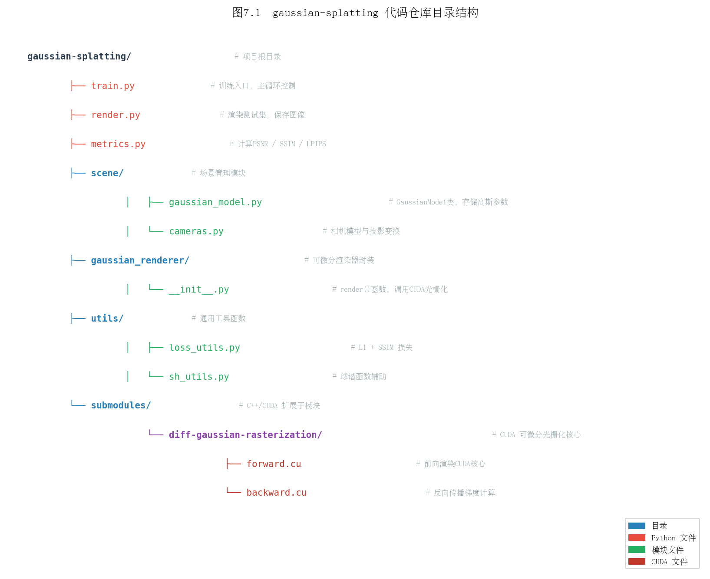
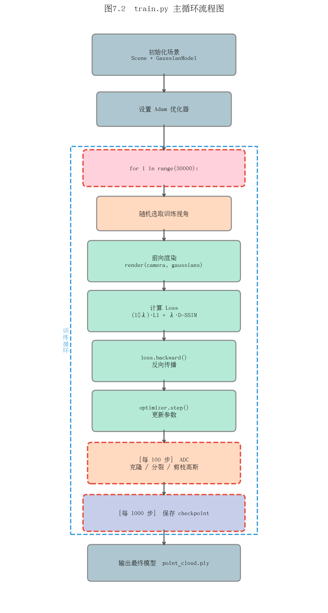
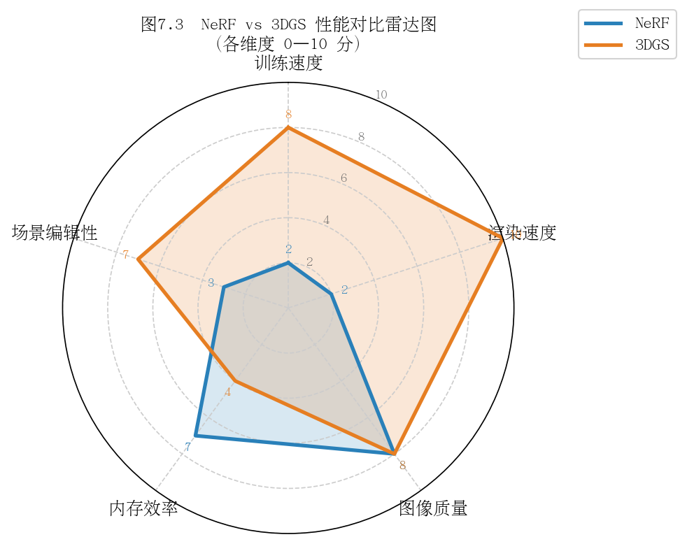

# 第七章：从原始论文到开源代码

## 7.1 原版3DGS论文精读（Kerbl et al. 2023）

### 核心贡献总结

2023年，Bernhard Kerbl、Georgios Kopanas、Thomas Leimkühler 与 George Drettakis 在 ACM SIGGRAPH 2023 上发表了论文 *3D Gaussian Splatting for Real-Time Radiance Field Rendering*。该论文提出了一种全新的场景表示与实时渲染范式，其核心贡献可归纳为以下四点：

1. **三维高斯作为场景原语**：摒弃传统隐式神经网络，以显式的三维高斯椭球体（3D Gaussian）作为场景的基本表示单元，每个高斯体携带位置、协方差、透明度与球谐系数等属性。

2. **可微分光栅化管线**：设计并实现了基于瓦片（tile-based）的可微分高斯光栅化器，支持从2D监督信号端到端反向传播至3D高斯参数，整合进CUDA内核以实现极高吞吐量。

3. **自适应密度控制（Adaptive Density Control，ADC）**：在训练过程中动态增殖（克隆/分裂）和剔除高斯体，使点云密度自适应地匹配场景几何与外观的复杂度。

4. **实时渲染能力**：在NVIDIA RTX 3090上可达1080p分辨率 > 100 FPS，远超同期NeRF类方法，同时在Tanks and Temples、Deep Blending等标准数据集上取得SOTA视觉质量。

---

### 与NeRF的5个关键差异

| 对比维度 | NeRF（原版） | 3D Gaussian Splatting |
|---|---|---|
| **场景表示** | 隐式MLP（坐标→颜色+密度） | 显式3D高斯点云 |
| **渲染方式** | 射线行进（Ray Marching），每像素数百次采样 | 可微分光栅化（Splatting），无需逐射线采样 |
| **训练速度** | 数小时至数天 | 30分钟以内（典型场景） |
| **推理帧率** | < 1 FPS（原版），经加速后~10 FPS | 100+ FPS（RTX 3090，1080p） |
| **场景可编辑性** | 困难（参数融合于MLP权重） | 直接操作高斯体，支持增删改 |

关键差异的本质在于**表示范式的转变**：NeRF将场景知识压缩进神经网络权重，属于黑箱结构；3DGS则将场景结构显式编码为几何意义明确的高斯体集合，可直接检视与操作。

---

### 实验结果解读

论文在三个主流数据集上评估：

- **Tanks and Temples**：室外大场景，Train场景PSNR达21.83，优于Mip-NeRF 360约1.1 dB，渲染速度提升约70倍。
- **Deep Blending**：室内反光场景，DrJohnson场景SSIM达0.900，高于InstantNGP的0.869。
- **Mip-NeRF 360数据集**：室内外混合场景，Garden场景PSNR 27.45，是当时最高值之一。

值得注意的是，3DGS的显存占用显著高于NeRF类方法（单场景可达数GB），这是以存储换速度的必然代价。论文中也坦承在某些细节纹理（如植被）上存在"爆米花"浮渣伪影，后续工作对此进行了大量改进。

---

### 引用数与学术影响力

截至2025年，该论文引用量已超过 **4000次**（Google Scholar），是计算机视觉与图形学领域近年引用增长最快的论文之一。其代码库（GitHub `graphdeco-inria/gaussian-splatting`）在发布后一年内积累了超过 **15,000 stars**，催生了大量衍生工作，包括但不限于：

- 动态场景重建（4D Gaussians、Deformable 3DGS）
- SLAM系统（SplaTAM、Gaussian-SLAM）
- 城市级大场景（CityGaussian、VastGaussian）
- 文本/图像驱动的场景生成与编辑（GaussianEditor、Instruct-GS2GS）

> **思考题**
>
> 1. 3DGS的"显式表示"相比NeRF的"隐式表示"，在场景编辑任务（如移除某个物体）中具体带来了哪些便利？又会引入哪些新问题？
> 2. 实验中3DGS在存储占用上的劣势是否可以接受？在哪些应用场景下这一劣势会成为瓶颈？
> 3. 若要将3DGS扩展到视频（动态场景），最直接的思路是什么？文献中有哪些代表性方案？

---

## 7.2 代码仓库结构导览

### gaussian-splatting 仓库文件树



仓库根目录的顶层结构如下（伪代码说明，非真实完整内容）：

```
gaussian-splatting/
├── train.py                  # 训练入口：场景加载、优化循环、ADC
├── render.py                 # 渲染入口：加载checkpoint、批量渲染、存图
├── metrics.py                # 评估指标：PSNR、SSIM、LPIPS
├── full_eval.py              # 完整评估流程封装
│
├── scene/                    # 场景数据层
│   ├── __init__.py           # Scene类：管理相机、点云、高斯模型
│   ├── cameras.py            # Camera类：相机内外参封装
│   ├── colmap_loader.py      # COLMAP结果解析（点云+相机）
│   ├── dataset_readers.py    # 数据集读取接口（COLMAP/Blender格式）
│   └── gaussian_model.py     # GaussianModel类：高斯体的核心数据结构与操作
│
├── gaussian_renderer/        # 渲染层
│   ├── __init__.py           # render()函数：调用CUDA光栅化器
│   └── network_gui.py        # 可选：实时GUI可视化通信
│
├── utils/                    # 工具函数层
│   ├── camera_utils.py       # 相机变换辅助函数
│   ├── general_utils.py      # 通用工具（build_rotation等）
│   ├── graphics_utils.py     # 图形数学（投影、四元数等）
│   ├── image_utils.py        # 图像处理（mse2psnr等）
│   ├── loss_utils.py         # 损失函数（L1+SSIM）
│   ├── sh_utils.py           # 球谐函数辅助
│   └── system_utils.py       # 文件系统工具
│
├── submodules/               # CUDA扩展子模块
│   ├── diff-gaussian-rasterization/   # 可微分光栅化器（核心CUDA代码）
│   └── simple-knn/                    # 空间最近邻（用于初始化缩放）
│
├── arguments/                # 命令行参数定义
│   └── __init__.py           # ModelParams、PipelineParams、OptimizationParams
│
└── output/                   # 训练输出目录（运行时生成）
    └── <experiment_name>/
        ├── point_cloud/      # 各迭代checkpoint（.ply格式）
        └── cameras.json      # 相机参数导出
```

---

### scene/、gaussian_renderer/、utils/ 各目录职责

**`scene/` —— 数据与模型层**

`scene/` 是整个仓库的数据核心。`GaussianModel` 类（定义于 `gaussian_model.py`）持有所有高斯体的可学习参数：

```python
# gaussian_model.py 核心属性（伪代码说明）
self._xyz          # 位置：(N, 3)，可学习
self._features_dc  # 球谐0阶系数（漫反射颜色）：(N, 1, 3)
self._features_rest# 高阶球谐系数（视角相关颜色）：(N, 15, 3)
self._scaling      # 缩放（log空间）：(N, 3)
self._rotation     # 旋转四元数：(N, 4)
self._opacity      # 不透明度（sigmoid前）：(N, 1)
```

`Scene` 类负责从磁盘加载COLMAP或合成数据集，将相机列表与初始点云传递给 `GaussianModel`，并将训练集/测试集相机划分好以供训练循环使用。

**`gaussian_renderer/` —— 渲染层**

该目录是Python层与CUDA内核的接口桥梁。其 `render()` 函数接收一个相机视图和高斯模型，完成：投影高斯到2D → 计算瓦片覆盖 → 按深度排序 → alpha合成。整个过程通过 `diff-gaussian-rasterization` CUDA扩展完成，梯度可以流回所有高斯属性。

**`utils/` —— 工具层**

无依赖的纯工具函数集合。关键模块包括：
- `loss_utils.py`：实现 $\mathcal{L} = (1-\lambda) \mathcal{L}_1 + \lambda \mathcal{L}_{D\text{-SSIM}}$
- `graphics_utils.py`：`getWorld2View2()`、`getProjectionMatrix()` 等相机变换
- `sh_utils.py`：球谐函数基底计算

---

### CUDA扩展（diff-gaussian-rasterization）的作用

`diff-gaussian-rasterization` 是整个3DGS性能的关键所在，以git submodule形式引入。其核心职责：

1. **前向传播（forward）**：将N个3D高斯体投影为2D高斯椭圆，执行瓦片剔除与排序，按前到后顺序执行alpha合成，输出最终图像及辅助缓冲（深度、累积透明度等）。

2. **反向传播（backward）**：计算输出图像对每个高斯体所有属性（位置、协方差、不透明度、颜色）的梯度，支持PyTorch autograd框架。

3. **性能优化**：使用CUDA shared memory缓存瓦片内高斯数据，避免全局内存带宽瓶颈；基于 `radix sort` 实现高效深度排序。

```bash
# 安装方式（需要CUDA编译环境）
pip install submodules/diff-gaussian-rasterization
pip install submodules/simple-knn
```

> **思考题**
>
> 1. 为什么将光栅化器实现为独立的CUDA扩展，而不是直接使用PyTorch的内置算子？这一设计决策对可复现性有何影响？
> 2. `gaussian_model.py` 中缩放（scaling）和不透明度（opacity）均在log/sigmoid空间存储，而非直接存储物理量，这样做有什么好处？
> 3. 如果你想为3DGS添加一种新的属性（如温度场），需要修改仓库中的哪些文件？

---

## 7.3 train.py 主循环解读

### 总体流程概览



`train.py` 的 `training()` 函数体现了3DGS完整的优化逻辑，可分为六个阶段：

---

### 阶段一：初始化

```python
# 伪代码说明：初始化三大组件
gaussians = GaussianModel(dataset.sh_degree)          # 创建高斯模型（空）
scene = Scene(dataset, gaussians)                      # 加载相机+点云，初始化高斯体
gaussians.training_setup(opt)                          # 创建各参数的Adam优化器
```

初始化阶段将COLMAP稀疏点云中的每个3D点转化为一个高斯体，初始缩放由最近邻距离估算，不透明度统一设为0.1，颜色由点云RGB初始化为球谐系数。

---

### 阶段二：前向渲染

```python
# 伪代码说明：每次迭代随机采样一个训练视图并渲染
viewpoint_cam = random.choice(scene.getTrainCameras())
render_pkg = render(viewpoint_cam, gaussians, pipe, background)
image = render_pkg["render"]         # 渲染图像 (3, H, W)
viewspace_points = render_pkg["viewspace_points"]   # 2D投影点（用于ADC梯度）
visibility_filter = render_pkg["visibility_filter"] # 本次可见的高斯索引
radii = render_pkg["radii"]          # 各高斯在图像空间的半径（用于ADC判断）
```

`render()` 函数（定义于 `gaussian_renderer/__init__.py`）负责调用CUDA光栅化器，返回渲染结果及必要的辅助信息供ADC使用。

---

### 阶段三：Loss计算

```python
# 伪代码说明：混合L1与SSIM损失
gt_image = viewpoint_cam.original_image             # 真值图像 (3, H, W)
Ll1 = l1_loss(image, gt_image)
loss = (1.0 - opt.lambda_dssim) * Ll1 + opt.lambda_dssim * (1.0 - ssim(image, gt_image))
```

默认 `lambda_dssim = 0.2`，即80% L1 + 20% D-SSIM。L1保证整体亮度正确，SSIM项约束结构一致性，两者配合对抗高斯体的"过拟合"浮渣。

---

### 阶段四：反向传播

```python
# 伪代码说明：标准反向传播
loss.backward()
# 梯度通过渲染器流回所有高斯属性
# viewspace_points.grad 记录2D投影点的梯度，供ADC使用
```

梯度的计算路径：`loss → image → CUDA光栅化器（backward kernel）→ 各高斯体属性`。需要注意，由于高斯体的深度排序不可微，3DGS使用了一种近似的梯度估计策略。

---

### 阶段五：参数更新

```python
# 伪代码说明：多个独立优化器分别步进
gaussians.optimizer.step()
gaussians.optimizer.zero_grad(set_to_none=True)
# 学习率衰减（xyz使用指数衰减调度）
gaussians.update_learning_rate(iteration)
# 球谐阶数从0阶开始，每1000次迭代升一阶
gaussians.oneupSHdegree()
```

3DGS对不同参数使用不同学习率：xyz位置约 `1.6e-4`（带指数衰减），球谐系数 `2.5e-3`，不透明度 `5e-2`，缩放和旋转 `5e-3`。

---

### 阶段六：自适应密度控制（ADC）

ADC是3DGS训练中最独特的部分，在迭代100至15000之间每100步执行一次：

```python
# 伪代码说明：ADC三步操作
# 1. 统计2D投影梯度均值，识别"欠重建"区域
gaussians.add_densification_stats(viewspace_points, visibility_filter)

if iteration % densification_interval == 0:
    # 2. 克隆（小高斯，梯度大）或分裂（大高斯，梯度大）
    gaussians.densify_and_prune(
        opt.densify_grad_threshold,   # 梯度阈值，默认0.0002
        0.005,                         # 不透明度剔除阈值
        scene.cameras_extent,
        opt.max_screen_size            # 过大高斯分裂阈值
    )

# 3. 定期将不透明度重置为接近0（防止浮渣积累）
if iteration % opacity_reset_interval == 0:
    gaussians.reset_opacity()
```

ADC的核心逻辑：2D投影梯度大意味着该区域重建不足，需要增加高斯体密度；而过大或不透明度极低的高斯体则被删除以减少冗余。

---

### 关键函数调用关系

```
[图7-3：train.py 关键函数调用与数据流示意图]
（建议绘制从train()出发的函数依赖图，标注数据流向：
 Scene.__init__ → GaussianModel.create_from_pcd
 render() → rasterize_gaussians()（CUDA）
 densify_and_prune() → clone_gaussians() / split_gaussians() / prune_points()）
```

```
training()
├── Scene(dataset, gaussians)
│   └── GaussianModel.create_from_pcd(pcd)       # 点云→初始高斯体
├── [迭代循环]
│   ├── render(cam, gaussians, pipe, bg)
│   │   └── rasterize_gaussians(...)              # CUDA前向
│   ├── l1_loss() + ssim()                        # 损失计算
│   ├── loss.backward()                           # CUDA反向
│   ├── gaussians.optimizer.step()                # 参数更新
│   └── gaussians.densify_and_prune(...)          # ADC
│       ├── densification_postfix()               # 克隆/分裂后重组张量
│       └── prune_points(mask)                    # 删除高斯体
└── scene.save(iteration)                         # 保存.ply checkpoint
```

> **思考题**
>
> 1. ADC中的"克隆"与"分裂"分别针对什么情况？在几何意义上，两者解决了什么不同的重建问题？
> 2. 为什么要定期执行 `reset_opacity()`？若不执行，训练会出现什么现象？
> 3. 3DGS使用多个独立的Adam优化器管理不同参数组，相比使用单一优化器有什么优势？在实现上需要注意哪些细节？

---

## 7.4 render.py 与评估

### render() 函数

`gaussian_renderer/__init__.py` 中的 `render()` 是连接Python训练逻辑与CUDA光栅化器的核心接口：

```python
# 伪代码说明：render()函数主要步骤
def render(viewpoint_camera, pc, pipe, bg_color, scaling_modifier=1.0):
    # 1. 提取高斯属性
    xyz = pc.get_xyz                          # (N, 3)
    opacity = pc.get_opacity                  # (N, 1)，经sigmoid激活
    scales = pc.get_scaling                   # (N, 3)，经exp激活
    rotations = pc.get_rotation               # (N, 4)，经归一化
    colors = pc.get_features                  # (N, 16, 3)，球谐系数

    # 2. 计算2D协方差（3D高斯→2D高斯投影）
    cov3D_precomp = None  # 若不预计算，CUDA内核自行计算

    # 3. 调用CUDA光栅化器
    rendered_image, radii = rasterize_gaussians(
        xyz, colors, opacity, scales, rotations,
        viewpoint_camera, pipe, bg_color, ...
    )
    return {"render": rendered_image, "radii": radii, ...}
```

**render.py（根目录）** 则是命令行渲染脚本：加载训练好的 `.ply` checkpoint，遍历测试集相机，调用上述 `render()` 函数，将结果存储为PNG图像，同时记录渲染时间。

---

### metrics.py 中 PSNR/SSIM/LPIPS 计算

```python
# 伪代码说明：三种指标的计算逻辑
# PSNR：基于均方误差，单位dB，越高越好（无参考上限约50dB）
psnr_value = 10 * log10(1.0 / mse(render, gt))

# SSIM：结构相似性，范围[0,1]，越高越好
# 考虑亮度、对比度、结构三个成分的乘积
ssim_value = ssim(render, gt)   # 使用滑动窗口计算局部统计量

# LPIPS：学习感知图像块相似度，越低越好
# 使用预训练VGG/AlexNet提取特征，计算特征空间距离
lpips_value = lpips_fn(render * 2 - 1, gt * 2 - 1)  # 注意归一化到[-1,1]
```

三指标的互补关系：
- **PSNR** 对逐像素亮度误差敏感，但对人眼不重要的高频噪声也会惩罚，有时与主观质量相关性较低。
- **SSIM** 更关注结构，对整体亮度偏移不敏感，能更好地反映场景结构是否正确重建。
- **LPIPS** 基于深度特征，最接近人类感知判断，但计算成本最高，且依赖特定预训练网络。

---

### 如何解读评估结果

运行 `python metrics.py -m <output_dir>` 后，结果以JSON格式输出，典型值范围如下（以Tanks and Temples为参考）：

| 指标 | 较差 | 一般 | 良好 | 优秀 |
|---|---|---|---|---|
| PSNR (dB) | < 20 | 20–24 | 24–27 | > 27 |
| SSIM | < 0.7 | 0.7–0.85 | 0.85–0.92 | > 0.92 |
| LPIPS | > 0.3 | 0.2–0.3 | 0.1–0.2 | < 0.1 |

**常见解读陷阱**：

1. **数据集差异**：室外大场景（Tanks and Temples）的PSNR普遍低于室内受控场景（Blender合成数据集可达30+ dB），不可跨数据集直接比较。

2. **测试集划分影响**：COLMAP格式默认按文件名排序选取每8张图为测试集，Blender格式有独立测试集目录。确认划分方式才能与论文数字对比。

3. **训练迭代次数**：默认30000次迭代。在7000次时即可得到较好结果，但最终数字需跑完30000次对比。

4. **LPIPS指标选择**：论文中使用的是 `lpips` 库的 `alex` 网络，部分工作使用 `vgg`，两者数值有差异，比较时需统一。



> **思考题**
>
> 1. 若某个场景的PSNR很高但LPIPS也偏高（较差），说明了什么？这种情况在什么类型的场景中容易出现？
> 2. render.py 在测试时对所有相机顺序渲染，而train.py随机采样。这种差异对评估公平性有何影响？是否存在"遗忘"问题？
> 3. 如何设计一个评估流程，以判断3DGS模型是否在训练视图上过拟合？

---

## 7.5 常见报错排查

### 问题一：CUDA Out of Memory（显存不足）

**症状**：训练中途崩溃，报错 `RuntimeError: CUDA out of memory`，或直接进程被系统OOM Killer终止。

**根本原因**：高斯体数量（N）随ADC不断增长，当N过大时，光栅化器中间缓冲区（排序数组、瓦片范围表等）可能超出显存上限。

**排查与解决**：

```bash
# 方法1：降低图像分辨率（减少瓦片数量，降低光栅化内存）
python train.py -s <data> --resolution 2   # 将图像缩小为1/2

# 方法2：限制最大高斯数量（牺牲部分质量换稳定性）
# 在 arguments/__init__.py 中调整或通过命令行：
python train.py -s <data> --max_num_splats 3000000

# 方法3：减少同时加载的相机图像数（针对相机数极多的场景）
# Scene初始化时降低 images_to_load 上限

# 方法4：使用更小的球谐阶数
python train.py -s <data> --sh_degree 1   # 从默认3降至1
```

**监控方式**：在训练过程中观察 `iteration XXXX` 日志中的高斯数量变化；若N在15000步后仍持续飙升，应检查ADC的 `prune` 条件是否有效触发。

---

### 问题二：COLMAP失败（特征不足）

**症状**：`colmap automatic_reconstructor` 执行后输出目录为空或相机数量极少；报错 `No good initial image pair found` 或 `Failed to find enough inliers`。

**根本原因**：输入图像特征稀少（如白墙、镜面、曝光过度）、图像间重叠不足、相机运动过快、图像质量差。

**排查与解决**：

```bash
# 检查COLMAP输出：稀疏点云点数是否合理（一般场景应>1000点）
# 在COLMAP GUI中检查：Images->右键->Show Matches 查看匹配对质量

# 方法1：增加图像密度（重新采集，增加帧率或放慢移动速度）

# 方法2：调整COLMAP特征提取参数（允许更多特征点）
colmap feature_extractor \
    --database_path database.db \
    --image_path images \
    --ImageReader.single_camera 1 \
    --SiftExtraction.max_num_features 8192   # 默认8192，可尝试提高

# 方法3：切换匹配策略（sequential适合视频帧，exhaustive适合无序图片集）
colmap sequential_matcher --database_path database.db

# 方法4：对特征缺乏区域（镜面）使用掩码（mask）排除
```

**经验法则**：拍摄时保证相邻帧重叠度 > 60%，避免纯色背景，控制单帧运动模糊。

---

### 问题三：渲染黑屏

**症状**：`render.py` 执行成功，但输出PNG全黑，或在实时查看器中场景消失。

**根本原因排查路径**：

```
黑屏
├── 背景颜色设置问题
│   → 检查 --white_background 参数是否与训练时一致
├── 相机参数错误
│   → 检查 cameras.json 中 fx/fy/cx/cy 是否合理
│   → 检查 near/far clip plane 是否将场景裁剪掉
├── 不透明度全为0
│   → 可能是 opacity_reset 后未继续训练；检查checkpoint迭代数
├── 场景尺度极大或极小
│   → 检查 cameras_extent 是否异常；scene.cameras_extent 应在合理范围（0.1~100）
└── CUDA扩展版本不匹配
    → 重新编译 diff-gaussian-rasterization
    → pip install submodules/diff-gaussian-rasterization --force-reinstall
```

---

### 问题四：训练不收敛

**症状**：Loss在数千次迭代后仍居高不下（L1 loss > 0.1），或PSNR在7000步时仍低于15 dB，或渲染图像呈现大量"爆米花"浮渣点。

**常见原因与对策**：

```
训练不收敛
├── 初始点云质量差（COLMAP稀疏点太少）
│   → 使用 --resolution 1 保留最高精度；检查SfM重建质量
├── 学习率设置不当
│   → 使用默认参数，避免手动调整；检查 arguments/__init__.py 中参数
├── ADC阈值过于保守（densify_grad_threshold过大）
│   → 适当降低至 0.0001 尝试
├── 场景尺度异常（如场景中存在离群点）
│   → 在COLMAP/点云预处理阶段过滤离群点
│   → 使用 --init_pcd_path 提供经过清洗的点云
└── 数据集路径或格式错误
    → 确认 transforms_train.json（Blender格式）或 sparse/0/（COLMAP格式）存在
    → 确认图像路径与JSON中记录一致
```

**诊断步骤**：首先在小型合成数据集（如Blender的Lego场景）上验证代码正确性，再处理自定义场景。

---

### 问题五：Windows/Linux 差异

3DGS官方主要在Linux（Ubuntu 20.04/22.04）上开发和测试，在Windows上运行需注意以下差异：

| 问题 | 原因 | 解决方案 |
|---|---|---|
| CUDA扩展编译失败 | MSVC编译器与nvcc兼容性问题 | 安装Visual Studio 2019/2022，确认环境变量；或使用WSL2 |
| 路径分隔符错误 | Python中硬编码了 `/` 路径 | 使用 `pathlib.Path` 或确认代码使用 `os.path.join` |
| `simple-knn` 编译报错 | Windows不支持某些POSIX头文件 | 按官方Issue应用对应补丁；或使用预编译wheel |
| 显存分配失败概率更高 | Windows显卡驱动保留更多显存 | 关闭其他GPU应用；适当降低分辨率 |
| COLMAP路径空格问题 | Windows路径含空格导致参数解析错误 | 将数据放置于不含空格的路径下 |

**推荐方案**：在Windows上，优先使用 **WSL2（Windows Subsystem for Linux 2）**，配合NVIDIA Container Toolkit或直接使用CUDA-enabled WSL2环境，可获得接近原生Linux的体验，规避大多数兼容性问题。

```bash
# WSL2中确认CUDA可用
nvidia-smi    # 应显示GPU信息
nvcc --version  # 应显示CUDA版本
```

> **思考题**
>
> 1. 训练过程中高斯数量持续增长，最终达到500万个，但PSNR反而开始下降，这种现象被称为什么？应如何从代码层面加以缓解？
> 2. COLMAP重建失败时，有哪些不依赖COLMAP的替代SfM/位姿估计方案可以为3DGS提供初始化？
> 3. 设计一个系统性的调试流程：当一个新场景训练结果不理想时，你会按什么顺序检查哪些因素？

---

*本章完*

---

*上一章：[第六章：3DGS 核心算法详解](chapter6.md)  | 下一章：[第八章：数据准备与训练实战](chapter8.md)*
