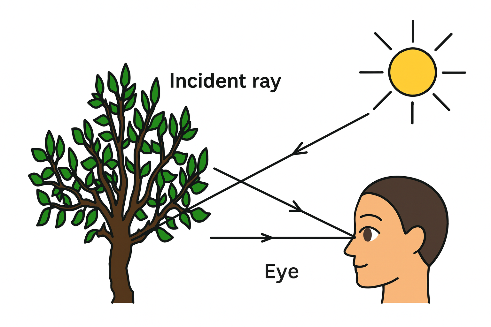
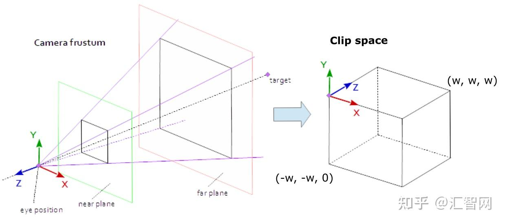
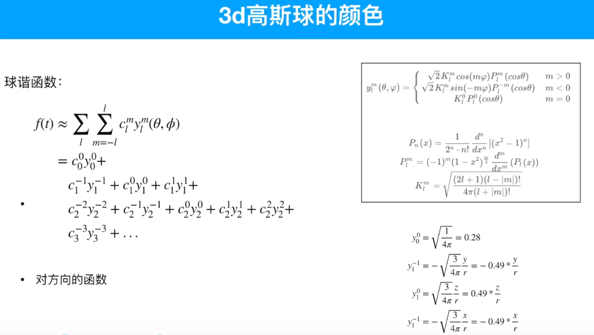
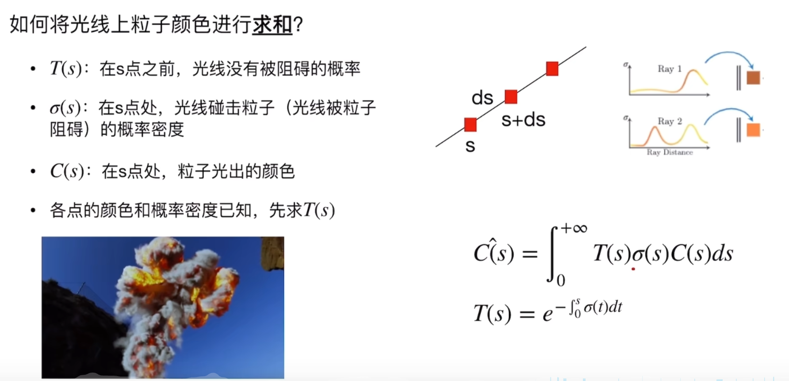
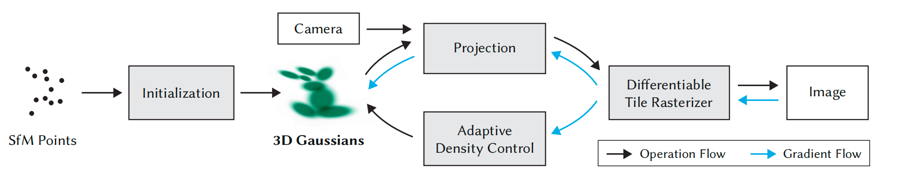
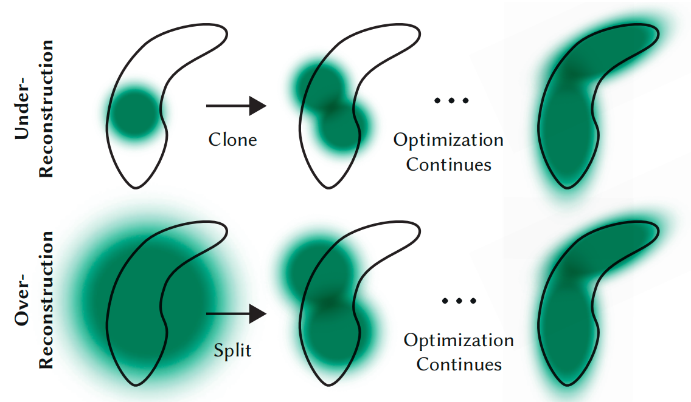

# 3D Gaussian Splatting 
## 背景

3D Gaussian Splatting 技术主要用于计算机图形学中的渲染任务，即**新视角合成**。给定一个场景的少量 2D 照片后，该技术可以生成这个场景中任意新的、未曾拍摄过的 3D 视角图像。本质上，它先对 3D 场景进行建模，再根据不同相机位置和视角渲染出对应图像。

理解渲染可以从人眼成像过程出发：光线照射到物体上，经过反射进入人眼，人眼因此看到物体颜色。渲染过程可看作这个过程的逆向：光线从人眼或相机出发，经过 3D 高斯球（严格说是高斯密度）后形成图像，也可理解为逆向光线追踪。

整体流程可以概括为：

```text
COLMAP 生成关键点（均值）
        ↓
膨胀成 3D 高斯球
        ↓
Splatting 投影到 2D 平面（密度）
        ↓
累加后得到渲染图像（体渲染）
```



## 数学原理

### “变换”介绍

NDC 是 **Normalized Device Coordinates**（归一化设备坐标）。

NDC 可以理解为一个“中间人”：

1. **投影变换**：不关心屏幕实际尺寸，先把所有对象压缩到 `[-1, 1]` 的标准盒子里。
2. **视口变换**：拿到 `[-1, 1]` 的标准盒子后，再映射到具体屏幕像素。例如屏幕宽度为 1920 时，将 -1 映射到 0，将 1 映射到 1920。

| 步骤 | 变换名称 | 坐标系变化 | 核心作用 |
| --- | --- | --- | --- |
| 1 | **观测变换** | 世界 $\rightarrow$ 相机 | **摆正视角**：以相机为中心重新描述世界。 |
| 2 | **投影变换** | 相机 $\rightarrow$ NDC（标准立方体） | **3D 转 2D**：处理近大远小，归一化坐标。 |
| 3 | **视口变换** | NDC $\rightarrow$ 屏幕像素 | **上屏显示**：将归一化数据画到具体像素上。 |

$$
\text{世界坐标系}
\xrightarrow{\text{观测变换}}
\text{相机坐标系}
\xrightarrow{\text{投影变换}}
\text{标准化设备坐标系 (NDC)}
\xrightarrow{\text{视口变换}}
\text{像素坐标系}
$$

### 投影变换

将点从**相机坐标系（Camera Space / View Space）**变换到 **NDC（Normalized Device Coordinates）** 通常分为两步：

1. **投影变换（Projection）**：乘以投影矩阵，得到裁剪空间坐标（Clip Space）。
2. **透视除法（Perspective Division）**：除以 $w$ 分量，得到 NDC。

#### 总体流程

假设相机坐标系下的点为：

$$
P_{cam} = [x_e, y_e, z_e, 1]^T
$$

第一步，计算裁剪空间坐标：

$$
P_{clip} = M_{proj} \cdot P_{cam}
= \begin{bmatrix} x_c \\ y_c \\ z_c \\ w_c \end{bmatrix}
$$

第二步，透视除法得到 NDC：

$$
P_{ndc}
= \begin{bmatrix} x_{ndc} \\ y_{ndc} \\ z_{ndc} \end{bmatrix}
= \begin{bmatrix} x_c / w_c \\ y_c / w_c \\ z_c / w_c \end{bmatrix}
$$

透视投影矩阵 $M_{proj}$ 的构造为：

$$
M_{proj} =
\begin{bmatrix}
\frac{1}{ar \cdot \tan(\frac{fov}{2})} & 0 & 0 & 0 \\
0 & \frac{1}{\tan(\frac{fov}{2})} & 0 & 0 \\
0 & 0 & -\frac{f+n}{f-n} & -\frac{2fn}{f-n} \\
0 & 0 & -1 & 0
\end{bmatrix}
$$

参数定义：

- $f$：远平面距离（Far plane）
- $n$：近平面距离（Near plane）
- $fov$：垂直视场角（Field of View）
- $ar$：宽高比（Aspect Ratio，$width / height$）



### 3D 高斯投影

在 3D 空间中，一个高斯函数由其中心 $\mathbf{\mu}$ 和协方差矩阵 $\mathbf{\Sigma}$ 定义：

$$
\mathcal{G}_{3D}(\mathbf{x}) =
\exp \left(
-\frac{1}{2}(\mathbf{x}-\mathbf{\mu})^T
\mathbf{\Sigma}^{-1}
(\mathbf{x}-\mathbf{\mu})
\right)
$$

投影变换本身是非线性的。若直接将 3D Gaussian 分布投影到 2D 图像平面，通常不能得到严格的 2D Gaussian 分布，会发生形变。因此 3DGS 会在高斯中心附近对投影过程做泰勒近似，把非线性变换局部线性化。

在 3D 高斯中心点 $\mu_{3d} = (t_x, t_y, t_z)$ 处，对投影过程函数 $\phi(x)$ 做一阶泰勒展开：

$$
\phi(x) \approx \phi(\mu_{3d}) + J \cdot (x - \mu_{3d})
$$

其中 $J$ 是投影变换在均值点处的**雅可比矩阵（Jacobian Matrix）**。

$$
M_1 =
\begin{bmatrix}
n & 0 & 0 & 0 \\
0 & n & 0 & 0 \\
0 & 0 & n+f & -nf \\
0 & 0 & 1 & 0
\end{bmatrix}
\rightarrow
J =
\begin{bmatrix}
\frac{\partial f_1}{\partial x} & \frac{\partial f_1}{\partial y} & \frac{\partial f_1}{\partial z} \\
\frac{\partial f_2}{\partial x} & \frac{\partial f_2}{\partial y} & \frac{\partial f_2}{\partial z} \\
\frac{\partial f_3}{\partial x} & \frac{\partial f_3}{\partial y} & \frac{\partial f_3}{\partial z}
\end{bmatrix}
=
\begin{bmatrix}
\frac{n}{z} & 0 & -\frac{nx}{z^2} \\
0 & \frac{n}{z} & -\frac{ny}{z^2} \\
0 & 0 & -\frac{nf}{z^2}
\end{bmatrix}
$$

对应代码如下：

```python
# 投影过程 f(x, y, z) 类比成一个函数 M_proj * p：
# f(p_0) + f'(p_0) * (p - p_0)
# 一阶泰勒展开的常数项对高斯分布的协方差没有影响
t = transformPoint4x3(mean, viewmatrix)  # 通过 viewmatrix 得到的 3D 坐标点
txtz = t[0] / t[2]
tytz = t[1] / t[2]
t[0] = min(limx, max(-limx, txtz)) * t[2]
t[1] = min(limy, max(-limy, tytz)) * t[2]

J = np.array(
    [
        [focal_x / t[2], 0, -(focal_x * t[0]) / (t[2] * t[2])],
        [0, focal_y / t[2], -(focal_y * t[1]) / (t[2] * t[2])],
        [0, 0, 0],
    ]
)
W = viewmatrix[:3, :3]
T = np.dot(J, W)

cov = np.dot(T, cov3D)
cov = np.dot(cov, T.T)
```

通过投影可以得到 2D 平面上的密度分布，为后续体渲染积分奠定基础。

### 球谐函数

3D Gaussian 中使用球谐函数表示颜色。球谐函数是 3D 空间中的正交基函数，可以类比 2D 空间中的正交基向量，或傅立叶变换中的 $\sin(nx), \cos(nx)$。

在 3D Gaussian Splatting 中，每个高斯球不仅存储一个 RGB 颜色值，而是存储一组 **SH 系数（Spherical Harmonics coefficients）**。也就是说，高斯球不仅有密度，还通过球谐函数表示视角相关颜色。

假设视角方向为 $d$（由 $\theta, \phi$ 决定），最终看到的颜色 $C(d)$ 是所有基函数的加权和：

$$
C(\theta, \phi) =
\sum_{\ell=0}^{L} \sum_{m=-\ell}^{\ell}
\underbrace{c_{\ell}^m}_{\text{学习到的系数}}
\cdot
\underbrace{Y_{\ell}^m(\theta, \phi)}_{\text{固定的基函数}}
$$

- $Y_{\ell}^m$（基函数）：已知的数学公式，类似 $\sin, \cos$，输入视角方向，输出一个值。
- $c_{\ell}^m$（系数）：需要训练或学习的参数。



### 体渲染



上图公式描述的是“光线穿过一串高斯球”的严谨数学定义，通常称为**体积渲染方程**。

#### 场景设定

- 图中的“光线”：从眼睛或相机出发，穿过成像平面（像素）的射线。
- 图中的 “s 点”：射线上的某一个位置，也就是距离眼睛或相机某个深度的位置。
- 图中的“粒子”：可理解为 3D 高斯球，即一团半透明的云。

#### 符号对应

**A. $\sigma(s)$：在 s 点处，光线碰撞粒子的概率密度**

- 可以理解为高斯球的“不透明度”或“浓度”。
- 如果 $s$ 位于高斯球中心，$\sigma$ 通常较大，光线更容易被拦截。
- 如果 $s$ 位于高斯球边缘或空气中，$\sigma$ 接近 0。

**B. $T(s)$：在 s 点之前，光线没有被阻碍的概率**

- 也称为“透射率”（Transmittance）或“剩余光线能量”。
- 如果前面的球很密，光线已经被遮挡很多，那么到达当前点时 $T(s)$ 会接近 0。
- 它表达了前方遮挡对后方粒子的影响。

**C. $C(s)$：在 s 点处，粒子发出的颜色**

- 可以理解为高斯球根据当前视角计算出的视线依赖颜色。

#### 公式翻译

最终像素颜色可以看作沿射线累计每个位置的贡献：

$$
\text{贡献} =
\underbrace{T(s)}_{\text{光线能到达这里的概率}}
\times
\underbrace{\sigma(s)}_{\text{光线在这里撞上的概率}}
\times
\underbrace{C(s)}_{\text{撞上后显示的颜色}}
$$

直观理解：

- $T(s)$ 表示前面的粒子还给当前点留下多少光线。
- $\sigma(s)$ 表示当前点有多大概率拦截光线。
- $C(s)$ 表示当前点贡献的颜色。

#### 3DGS 的离散求和

体渲染是积分公式，但在 3D Gaussian Splatting 的代码中，它被离散化为加法：

$$
\text{最终颜色} =
\sum_{i=1}^{N}
\underbrace{c_i}_{\text{颜色 } C}
\times
\underbrace{\alpha_i}_{\text{不透明度 } \sigma}
\times
\underbrace{T_i}_{\text{透射率 } T}
$$

其中 $T_i$ 的计算方式是：

$$
T_i = \prod_{j=1}^{i-1} (1 - \alpha_j)
$$

含义是：第 $i$ 个球能分到的光，等于前面所有球 $(1, \dots, i-1)$ 没有挡住后剩下的部分。

#### 小结

沿着从眼睛或相机出发的视线前进，一边计算前面的雾挡住了多少光（$T$），一边计算当前雾有多浓（$\sigma$）以及当前雾是什么颜色（$C$），然后加权累加，就得到该像素的最终颜色。

## 代码阅读

### preprocess 函数

补充说明：虽然每个高斯球是一个概率分布（中间密，边缘疏），但 `opacities` 定义的是这个分布在**中心点（最密处）的最高不透明度**。

当渲染某个像素时，该像素获得的最终 Alpha 值 $\alpha_{final}$ 由两部分相乘得到：

$$
\alpha_{final} =
\underbrace{\text{opacities}}_{\text{球本身的属性}}
\times
\underbrace{G_{2D}(x)}_{\text{高斯衰减项}}
$$

```python
rgbs = []  # rgb colors of gaussians
cov3Ds = []  # covariance of 3d gaussians
depths = []  # depth of 3d gaussians after view&proj transformation
radii = []  # radius of 2d gaussians
conic_opacity = []  # covariance inverse of 2d gaussian and opacity
points_xy_image = []  # mean of 2d guassians
for idx in range(P):
    # make sure point in frustum
    p_orig = orig_points[idx]
    p_view = in_frustum(p_orig, viewmatrix)
    if p_view is None:
        continue
    depths.append(p_view[2])

    # transform point, from world to ndc
    # Notice, projmatrix already processed as mvp matrix
    # p_orig 世界系点投影到 ndc
    p_hom = transformPoint4x4(p_orig, projmatrix)
    p_w = 1 / (p_hom[3] + 0.0000001)
    p_proj = [p_hom[0] * p_w, p_hom[1] * p_w, p_hom[2] * p_w]

    # compute 3d covarance by scaling and rotation parameters
    scale = scales[idx]
    rotation = rotations[idx]
    # 3d 协方差矩阵
    cov3D = computeCov3D(scale, scale_modifier, rotation)
    cov3Ds.append(cov3D)

    # compute 2D screen-space covariance matrix
    # based on splatting, -> JW Sigma W^T J^T
    # 应用雅可比矩阵 J 计算 2d 协方差矩阵
    cov = computeCov2D(
        p_orig, focal_x, focal_y, tan_fovx, tan_fovy, cov3D, viewmatrix
    )

    # invert covarance(EWA splatting)
    det = cov[0] * cov[2] - cov[1] * cov[1]  # 行列式
    if det == 0:
        depths.pop()
        cov3Ds.pop()
        continue
    # 协方差矩阵的逆矩阵，opacities 是预先设定的不透明度，标量值
    det_inv = 1 / det
    conic = [cov[2] * det_inv, -cov[1] * det_inv, cov[0] * det_inv]
    conic_opacity.append([conic[0], conic[1], conic[2], opacities[idx]])

    # compute radius, by finding eigenvalues of 2d covariance
    # transfrom point from NDC to Pixel
    mid = 0.5 * (cov[0] + cov[1])
    # 计算出椭圆的长短矩，应用协方差矩阵的奇异值计算
    lambda1 = mid + sqrt(max(0.1, mid * mid - det))
    lambda2 = mid - sqrt(max(0.1, mid * mid - det))
    my_radius = ceil(3 * sqrt(max(lambda1, lambda2)))

    # 点映射到像素点的位置
    point_image = [ndc2Pix(p_proj[0], W), ndc2Pix(p_proj[1], H)]

    radii.append(my_radius)
    points_xy_image.append(point_image)

    # convert spherical harmonics coefficients to RGB color
    sh = shs[idx]
    # 应用球谐系数表达的颜色
    result = computeColorFromSH(D, p_orig, cam_pos, sh)
    rgbs.append(result)

return dict(
    rgbs=rgbs,
    cov3Ds=cov3Ds,
    depths=depths,
    radii=radii,
    conic_opacity=conic_opacity,
    points_xy_image=points_xy_image,
)
```

### render 函数

高斯分布的计算公式：

$$
f(x) = \frac{1}{\sqrt{(2\pi)^k |\Sigma|}}
\exp\left(
-\frac{1}{2} (x - \mu)^T \Sigma^{-1} (x - \mu)
\right)
$$

```python
out_color = np.zeros((H, W, 3))
pbar = tqdm(range(H * W))

# loop pixel，遍历每个像素
for i in range(H):
    for j in range(W):
        pbar.update(1)
        pixf = [i, j]
        C = [0, 0, 0]

        # loop gaussian, 遍历每个点由近及远
        # point_list = np.argsort(depths)
        for idx in point_list:
            # init helper variables, transmirrance
            T = 1

            # Resample using conic matrix
            # (cf. "Surface Splatting" by Zwicker et al., 2001)
            xy = points_xy_image[idx]  # center of 2d gaussian
            d = [
                xy[0] - pixf[0],
                xy[1] - pixf[1],
            ]  # distance from center of pixel

            # 求 2d 高斯分布对应的指数部分
            con_o = conic_opacity[idx]
            power = (
                -0.5 * (con_o[0] * d[0] * d[0] + con_o[2] * d[1] * d[1])
                - con_o[1] * d[0] * d[1]
            )
            if power > 0:
                continue

            # Eq. (2) from 3D Gaussian splatting paper.
            # 求密度公式
            alpha = min(0.99, con_o[3] * np.exp(power))
            if alpha < 1 / 255:
                continue

            # 不透明度的累积值
            test_T = T * (1 - alpha)
            if test_T < 0.0001:
                break

            # Eq. (3) from 3D Gaussian splatting paper.
            color = features[idx]
            for ch in range(3):
                C[ch] += color[ch] * alpha * T

            T = test_T

        # get final color
        for ch in range(3):
            out_color[j, i, ch] = C[ch] + T * bg_color[ch]

return out_color
```

## 训练流程



### 训练参数

假设初始点云有 10000 个点，每个点膨胀成一个 3D 高斯椭球。每个椭球的参数包括：

- 中心点位置：$(x, y, z)$
- 协方差矩阵：$R, S$
- 球谐函数系数：$16 \times 3$
- 透明度：$\alpha$

### loss 函数

3DGS 的损失函数由 L1 误差和 D-SSIM 误差组成：

$$
\mathcal{L} = (1 - \lambda)\mathcal{L}_1 + \lambda \mathcal{L}_{\text{D-SSIM}}
$$

第一项是平均绝对误差（Mean Absolute Error）：

$$
\mathcal{L}_1 = | I_{\text{render}} - I_{\text{GT}} |
$$

即渲染图像与真实图像（Ground Truth）之间每个像素 RGB 值差异的绝对值。

第二项是相似度误差：

$$
\mathcal{L}_{\text{D-SSIM}} = 1 - \text{SSIM}(I_{\text{render}}, I_{\text{GT}})
$$

$$
\text{SSIM}(x, y) =
\frac{(2\mu_x\mu_y + C_1)(2\sigma_{xy} + C_2)}
{(\mu_x^2 + \mu_y^2 + C_1)(\sigma_x^2 + \sigma_y^2 + C_2)}
$$

SSIM（Structural Similarity Index）用于衡量两张图像的相似度，范围为 0 到 1，1 表示完全一致。SSIM 模拟人类视觉系统，关注**亮度、对比度和结构**。

### Adaptive Density Control

训练期间每隔一定迭代次数（例如每 100 iterations）会执行一次 Adaptive Density Control，根据高斯球状态决定其后续处理方式。



#### A. 克隆（Clone）—— 针对欠重建（Under-reconstruction）

- **场景**：高斯球方差（尺寸）很小，但位置梯度很大。
- **含义**：该区域应该有细节，但现有点太少，虽然梯度大但覆盖不足。
- **操作**：在该位置复制一个相同的高斯球。
- **结果**：该区域点数增加，更好地填充空洞。

#### B. 分裂（Split）—— 针对过重建（Over-reconstruction）

- **场景**：高斯球方差（尺寸）很大，且位置梯度很大。
- **含义**：一个很大的模糊团块试图覆盖复杂几何区域（例如栏杆边缘），但无法准确表达细节，因此误差较大。
- **操作**：删除这个大球，在原位置生成两个更小的高斯球，通常尺寸除以 1.6。
- **结果**：用更多小球替代一个大球，提高细节分辨率。

#### C. 剪枝（Prune）—— 针对无效点

场景 1：高斯球的**不透明度（Opacity）低于阈值**，例如 $< 0.005$。

- **含义**：该球几乎透明，对画面贡献很小。
- **操作**：直接删除。

场景 2：高斯球的**尺寸过大**，超过场景范围。

- **含义**：这通常是膨胀伪影（Artifact），表现为漂浮在空中的大雾。
- **操作**：直接删除。

## 参考资料

- <https://github.com/SY-007-Research/3dgs_render_python>
- <https://space.bilibili.com/644569334>
