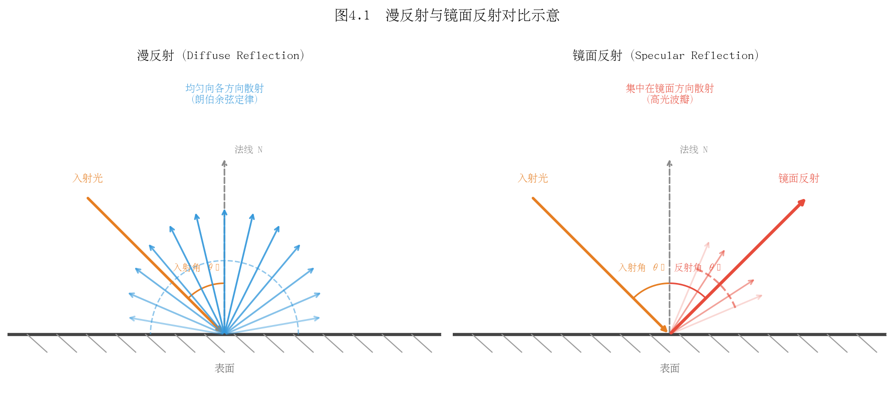
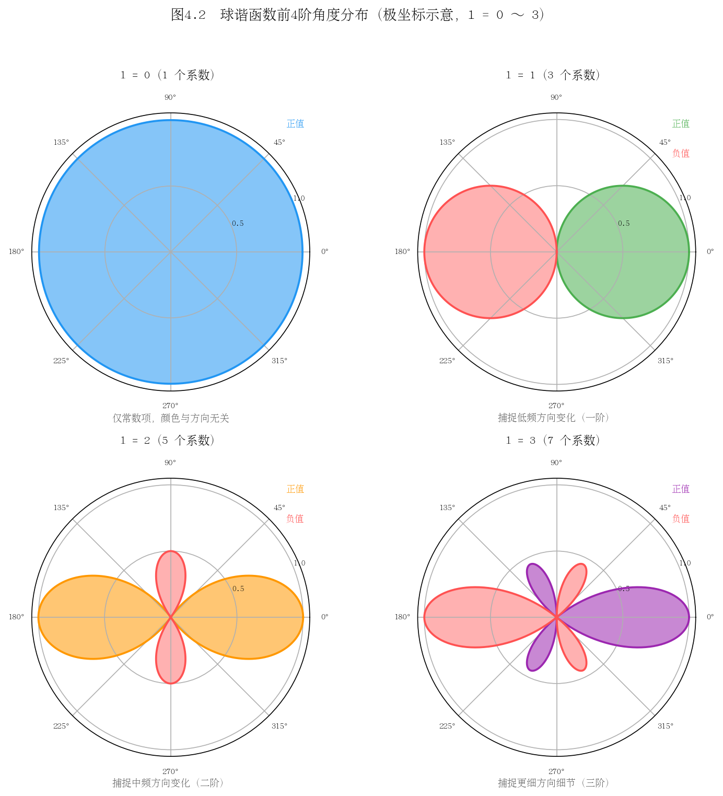
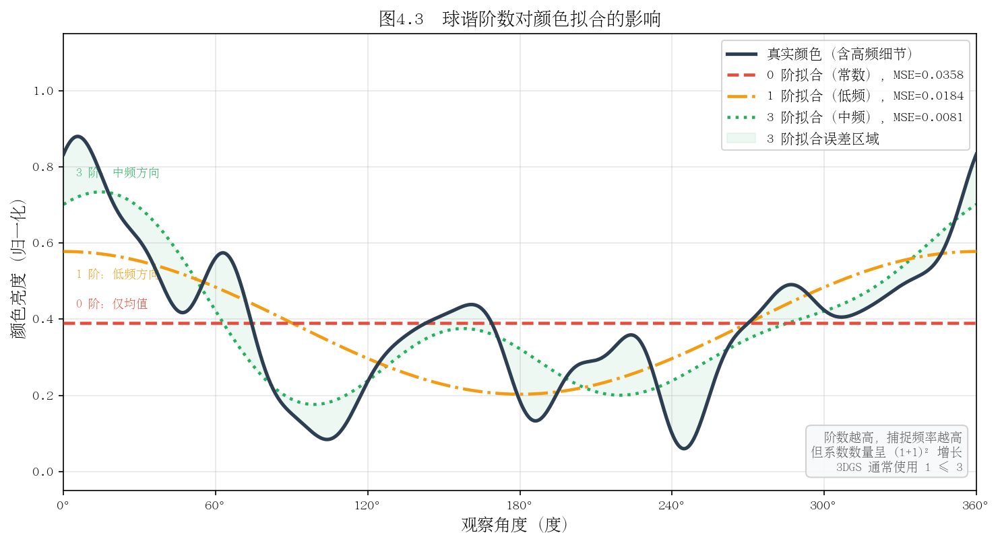

# 第四章：球谐函数与外观建模

---

## 4.1 颜色与观察方向的关系

### 朗伯体与非朗伯体

在三维场景重建中，物体表面的外观并非在所有观察方向上都相同。理解这一现象，需要首先区分两类理想化的反射模型。

<strong>朗伯体（Lambertian Surface）</strong>是最简单的漫反射模型。其核心假设是：表面向各个方向的辐射亮度（Radiance）与观察方向无关，只与入射光方向和表面法线之间的夹角余弦成正比。日常生活中，哑光墙面、纸张、未抛光木材等接近朗伯体。对于朗伯体，无论相机从哪个角度拍摄，同一个表面点的颜色（在相同光照下）几乎保持不变。

<strong>非朗伯体（Non-Lambertian Surface）</strong>则展现出与观察方向密切相关的外观变化。金属、玻璃、塑料表面、水面等都属于此类。当光线以特定角度照射时，这些表面会产生明显的镜面高光（Specular Highlight），高光的位置随观察方向改变而移动。

<strong>镜面反射（Specular Reflection）</strong>是非朗伯体行为中最典型的现象。根据经典的 Phong 模型或物理正确的 Cook-Torrance BRDF（双向反射分布函数），镜面反射强度与反射向量 $\mathbf{r}$ 和观察方向 $\mathbf{v}$ 之间的夹角密切相关：

$$L_s = k_s \cdot (\mathbf{r} \cdot \mathbf{v})^n$$

其中 $n$ 控制高光的锐利程度，$k_s$ 为镜面反射系数。

<!-- 配图占位 4-1：朗伯体 vs 镜面反射效果对比
     左图：同一个球体在朗伯体假设下从不同角度拍摄，颜色均匀一致
     右图：同一个球体具有镜面反射，不同观察角度下高光位置发生明显移动
     建议使用渲染软件（如 Blender）生成，角度间隔 30 度，共 6 个视角 -->

*图 4-1：左侧为朗伯体球，从不同方向观察颜色几乎不变；右侧为具有镜面反射的球，高光随观察方向移动。这一差异是场景中外观方向依赖性的直观体现。*

### 为什么需要方向相关颜色

在 3D Gaussian Splatting（3DGS）中，场景中的每个高斯基元需要表示真实世界中物体的外观。真实场景几乎不存在纯粹的朗伯体，金属框架、玻璃窗、光泽地板乃至人的皮肤都具有不同程度的视角依赖性。

如果仅为每个高斯赋予一个固定的 RGB 颜色（即假设朗伯体），则在多视图一致性重建时，模型不得不"妥协"——要么过度平滑高光区域，要么在不同训练视角之间产生矛盾的梯度信号，导致重建质量下降。

因此，3DGS 为每个高斯基元的颜色引入了**视角依赖性（View-Dependent Appearance）**：颜色不再是一个固定值，而是一个关于观察方向的函数：

$$\mathbf{c} = f(\mathbf{d})$$

其中 $\mathbf{d}$ 为归一化的观察方向向量，$f$ 是待学习的映射函数。如何高效、紧凑地表示这个定义在球面上的函数，正是球谐函数（Spherical Harmonics）的用武之地。

> **思考题 4.1**
> 1. 在室外场景重建中，天空和树叶的外观是否存在视角依赖性？请分别分析并说明原因。
> 2. 假设场景全部由朗伯体构成，使用方向相关颜色表示是否会带来额外的优化困难？为什么？
> 3. 双向反射分布函数（BRDF）中的"双向"指的是什么？它与本节讨论的观察方向依赖性有何联系？

---

## 4.2 球谐函数是什么

### 球面上的正交基函数

球谐函数（Spherical Harmonics，SH）是定义在单位球面 $S^2$ 上的一组特殊函数族。其核心性质是**正交完备性**：球面上任意平方可积函数 $f(\theta, \phi)$ 都可以用球谐函数的线性组合来近似表示，就如同欧氏空间中的任意向量可以用正交基向量展开一样。

正交性的数学表达为：

$$\int_{S^2} Y_l^m(\theta, \phi) \cdot Y_{l'}^{m'}(\theta, \phi) \, d\Omega = \delta_{ll'} \delta_{mm'}$$

其中 $d\Omega = \sin\theta \, d\theta \, d\phi$ 是球面面积元，$\delta$ 为 Kronecker delta。这意味着不同的球谐基函数之间相互正交，因此可以独立地编码不同的"频率分量"。

### 类比傅里叶级数

理解球谐函数的最直观方式是将其与**傅里叶级数**类比：

| 概念 | 傅里叶级数（圆上） | 球谐函数（球面上） |
|------|-------------------|-------------------|
| 定义域 | 单位圆 $[0, 2\pi)$ | 单位球面 $S^2$ |
| 基函数 | $\sin(n\theta), \cos(n\theta)$ | $Y_l^m(\theta, \phi)$ |
| 频率参数 | 阶数 $n$ | 阶数 $l$（频带） |
| 系数数量 | 每阶 2 个（$n>0$）| 每阶 $2l+1$ 个 |
| 低频 | 慢变化（大尺度轮廓） | 缓慢变化的球面函数 |
| 高频 | 快变化（细节） | 快速振荡的球面函数 |

傅里叶级数将周期函数分解为不同频率的正弦余弦波；球谐函数则将球面函数分解为不同"空间频率"的球面波。截断到有限阶数相当于对原始函数做低通滤波，保留主要的低频特征而舍弃高频细节。

### 阶数 $l$ 与频率的对应

球谐函数以**阶（Degree/Band）** $l = 0, 1, 2, 3, \ldots$ 和**次（Order）** $m = -l, -l+1, \ldots, l$ 来索引。每个阶 $l$ 包含 $2l+1$ 个基函数，前 $L$ 阶共包含 $\sum_{l=0}^{L-1}(2l+1) = L^2$ 个基函数。

- **$l=0$（0 阶）**：仅 1 个基函数 $Y_0^0$，值为常数——表示与方向无关的平均颜色；
- **$l=1$（1 阶）**：3 个基函数，能表示简单的方向性渐变（如一侧亮一侧暗）；
- **$l=2$（2 阶）**：5 个基函数，能捕捉更复杂的方向变化，如椭圆形高光；
- **$l=3$（3 阶）**：7 个基函数，可以表示较为精细的反射细节。

<!-- 配图占位 4-2：球谐基函数可视化（l=0,1,2 球面分布）
     按行排列：第一行 l=0（1个）；第二行 l=1（3个）；第三行 l=2（5个）
     每个函数用球面上的正值（红色）和负值（蓝色）着色表示
     球的半径编码函数绝对值大小，形成花瓣状图案
     参考 Wikipedia "Spherical harmonics" 页面的标准可视化 -->

*图 4-2：球谐基函数 $Y_l^m$ 在球面上的分布。红色代表正值，蓝色代表负值。随着阶数 $l$ 增大，基函数的空间振荡频率逐渐提高，能捕捉更精细的方向变化。*

> **思考题 4.2**
> 1. 傅里叶变换在图像压缩（如 JPEG）中被广泛使用，球谐函数能否用于压缩球面图像（如环境贴图）？请说明思路。
> 2. 为什么每阶 $l$ 恰好有 $2l+1$ 个基函数，而不是其他数量？尝试从对称性或拉普拉斯算子的本征值角度思考。
> 3. 在实时渲染中，预计算辐射传输（PRT）大量使用球谐函数。请查阅相关资料，说明 PRT 是如何利用球谐函数的正交性加速计算的。

---

## 4.3 球谐函数的数学定义

### 实数形式 $Y_l^m(\theta, \phi)$

在物理学中，球谐函数通常以复数形式定义。然而在计算机图形学和 3DGS 的实现中，普遍采用**实数形式（Real Spherical Harmonics）**，因为 RGB 颜色本身是实数。

实数球谐函数 $Y_l^m(\theta, \phi)$ 的定义为：

$$Y_l^m(\theta, \phi) = \begin{cases} \sqrt{2} \cdot K_l^m \cdot \cos(m\phi) \cdot P_l^m(\cos\theta) & \text{若 } m > 0 \\ K_l^0 \cdot P_l^0(\cos\theta) & \text{若 } m = 0 \\ \sqrt{2} \cdot K_l^{|m|} \cdot \sin(|m|\phi) \cdot P_l^{|m|}(\cos\theta) & \text{若 } m < 0 \end{cases}$$

其中：
- $\theta \in [0, \pi]$ 为极角（天顶角），$\phi \in [0, 2\pi)$ 为方位角；
- $P_l^m$ 为**连带勒让德多项式（Associated Legendre Polynomial）**；
- 归一化系数 $K_l^m = \sqrt{\frac{(2l+1)}{4\pi} \cdot \frac{(l-|m|)!}{(l+|m|)!}}$。

前几阶的显式表达式（已归一化）如下，以笛卡尔分量 $(x, y, z)$ 表示：

**$l=0$：**
$$Y_0^0 = \frac{1}{2}\sqrt{\frac{1}{\pi}}$$

**$l=1$：**
$$Y_1^{-1} = \frac{1}{2}\sqrt{\frac{3}{\pi}} \cdot y, \quad Y_1^0 = \frac{1}{2}\sqrt{\frac{3}{\pi}} \cdot z, \quad Y_1^1 = \frac{1}{2}\sqrt{\frac{3}{\pi}} \cdot x$$

其中 $(x, y, z)$ 为单位方向向量分量。这种以笛卡尔分量表示的形式在实际实现中更为常用，避免了三角函数的计算。

**$l=2$：**（共 5 个基函数，涉及 $xy, yz, xz, x^2-y^2, 3z^2-1$ 等二次项）

**$l=3$：**（共 7 个基函数，三次多项式形式）

### 前 4 阶系数数量

| 阶数 $l$ | 基函数数量 $2l+1$ | 累计基函数数 |
|----------|-------------------|--------------|
| 0        | 1                 | 1            |
| 1        | 3                 | 4            |
| 2        | 5                 | 9            |
| 3        | 7                 | 16           |

### 总计 16 个基函数

使用前 4 阶（$l = 0, 1, 2, 3$）共 $4^2 = 16$ 个实数球谐基函数，对于 RGB 三通道颜色，每个高斯基元需要存储 $16 \times 3 = 48$ 个浮点数的球谐系数。这是 3DGS 官方实现（即 3 阶球谐）的标准配置，在表达能力和存储开销之间取得了较好的平衡。

> **思考题 4.3**
> 1. 在 3DGS 代码实现中，球谐函数通常以方向向量的 $(x, y, z)$ 分量而非 $(\theta, \phi)$ 角度作为输入，请说明这样做的计算优势。
> 2. 连带勒让德多项式 $P_l^m$ 满足递推关系。查阅其递推公式，思考如何用递推方式高效计算所有 16 个基函数的值，避免重复计算。
> 3. 归一化系数 $K_l^m$ 的作用是什么？若不归一化，正交性条件会如何改变？

---

## 4.4 用球谐函数表示颜色

### RGB 各通道独立展开

在 3DGS 中，每个高斯基元的颜色被表示为观察方向 $\mathbf{d}$ 的函数。对 RGB 三个通道分别进行球谐展开：

$$c_R(\mathbf{d}) = \sum_{l=0}^{L-1} \sum_{m=-l}^{l} k_{l,m}^R \cdot Y_l^m(\mathbf{d})$$

$$c_G(\mathbf{d}) = \sum_{l=0}^{L-1} \sum_{m=-l}^{l} k_{l,m}^G \cdot Y_l^m(\mathbf{d})$$

$$c_B(\mathbf{d}) = \sum_{l=0}^{L-1} \sum_{m=-l}^{l} k_{l,m}^B \cdot Y_l^m(\mathbf{d})$$

三个通道相互独立，分别学习各自的球谐系数。这一设计的合理性在于：红、绿、蓝三个通道对应的光谱响应不同，视角依赖性的强度和形态也可能有所差异（例如金属在不同波长下的反射率不同）。

### 已知方向如何计算颜色——线性组合

给定一个归一化的观察方向向量 $\mathbf{d} = (x, y, z)$（满足 $x^2+y^2+z^2=1$），计算颜色的步骤如下：

<strong>第一步：计算所有基函数的值。</strong>将 $\mathbf{d}$ 代入 16 个（3 阶时）球谐基函数，得到一个长度为 16 的向量：

$$\mathbf{Y}(\mathbf{d}) = [Y_0^0(\mathbf{d}),\ Y_1^{-1}(\mathbf{d}),\ Y_1^0(\mathbf{d}),\ Y_1^1(\mathbf{d}),\ Y_2^{-2}(\mathbf{d}),\ \ldots,\ Y_3^3(\mathbf{d})]$$

<strong>第二步：与系数向量做点积。</strong>对每个通道分别计算：

$$c_R = \mathbf{k}_R \cdot \mathbf{Y}(\mathbf{d}) = \sum_{i=1}^{16} k_i^R \cdot Y_i(\mathbf{d})$$

这是一个纯粹的**线性运算**，计算代价极低（16 次乘法，15 次加法），非常适合 GPU 并行计算。

<strong>第三步：激活函数映射到有效颜色范围。</strong>通常对计算结果加 0.5 的偏置后取 sigmoid 或直接截断到 $[0, 1]$：

$$\mathbf{c}(\mathbf{d}) = \sigma\!\left(\mathbf{c}_{\text{raw}}(\mathbf{d}) + 0.5\right)$$

### 系数作为可学习参数

球谐系数 $k_{l,m}^{R/G/B}$ 是 3DGS 优化过程中的**可学习参数**，与高斯的位置、协方差、不透明度等参数一起通过梯度下降进行更新。

从梯度反传的角度，由于颜色计算是关于系数的线性函数，梯度计算极为简单：渲染损失对系数 $k_{l,m}^R$ 的梯度直接等于对应的基函数值 $Y_l^m(\mathbf{d})$，不存在梯度消失或爆炸的风险。

在训练初始化阶段，通常将 0 阶系数（$Y_0^0$，对应平均颜色）初始化为一个与点云颜色相关的值，高阶系数初始化为零，使模型从朗伯体假设出发，逐步学习视角相关的细节。

> **思考题 4.4**
> 1. 设某高斯基元的 R 通道球谐系数向量为 $\mathbf{k}_R$，请写出当观察方向从正上方（$(0,0,1)$）变化到正前方（$(0,1,0)$）时，$c_R$ 变化量的计算公式。
> 2. 球谐系数展开是对颜色函数的全局近似。如果某个高斯只在场景中极小的立体角内可见（如被遮挡的表面），高阶系数是否仍然有意义？这对优化有何影响？
> 3. 3DGS 训练初期通常只启用 0 阶球谐（固定颜色），在一定迭代步数后才逐步引入高阶项。请解释这种课程学习（Curriculum Learning）策略的合理性。

---

## 4.5 阶数选择的工程折衷

### 0 阶——常色（无方向依赖）

使用 $l=0$ 时，每个高斯基元的颜色为常数：

$$\mathbf{c}(\mathbf{d}) = k_{0,0} \cdot Y_0^0 = \frac{k_{0,0}}{2\sqrt{\pi}}$$

这等价于传统的固定 RGB 颜色，与观察方向完全无关。每个高斯仅需 3 个颜色参数（RGB 各 1 个）。

<strong>适用场景：</strong>快速原型验证、朗伯体主导的场景（如户外大范围地形重建）、对存储有严格限制的移动端部署。

<strong>局限性：</strong>无法表示任何镜面反射、视角相关效果，高光区域会被平均成模糊的颜色，重建质量显著下降。

### 3 阶——质量与开销的平衡

使用 $l=0,1,2,3$（共 16 个基函数），每个高斯的颜色参数数量为 $16 \times 3 = 48$ 个浮点数。这是 3DGS 论文和官方实现的默认配置，也是业界最广泛采用的设置。

**选择 3 阶的理由：**
- 3 阶球谐能够有效捕捉低频镜面反射，覆盖了绝大多数室内外场景中的视角相关效果；
- 梯度计算高效，线性前向传播不引入额外的计算图复杂度；
- 存储开销可控，相比 0 阶仅增加 16 倍颜色参数，但整个高斯基元的总参数（含位置、协方差、不透明度）增量约为 30–40%；
- 3 阶对应的最高空间频率大致等同于 $7 \times 7$ 像素的局部高光分辨率，对于渲染而言已经足够。

<!-- 配图占位 4-3：不同阶数球谐的颜色拟合对比
     展示同一个具有高光的球体（或真实场景局部区域）在不同阶数 SH 下的重建效果
     从左到右：原始参考图 / 0阶（纯色）/ 1阶 / 2阶 / 3阶
     重点突出高光区域的还原质量，以及 PSNR/SSIM 指标随阶数的提升曲线 -->

*图 4-3：从 0 阶到 3 阶球谐对同一场景的颜色拟合效果。0 阶（常色）完全无法捕捉高光；1 阶可表示简单的方向性渐变；2 阶开始出现粗略的高光；3 阶已能较好还原真实材质的视角依赖外观。*

### 更高阶的边际收益

使用 4 阶及以上球谐，参数数量急剧增加：

| 最高阶 $L$ | 总基函数数 $L^2$ | 每高斯颜色参数 | 相对于 3 阶的增量 |
|-----------|----------------|---------------|-------------------|
| 1         | 1              | 3             | -94%              |
| 2         | 4              | 12            | -75%              |
| 3         | 9              | 27            | 基准               |
| 4         | 16             | 48            | +78%              |
| 5         | 25             | 75            | +178%             |

然而，实验表明从 3 阶升级到 4 阶，PSNR 的提升通常不超过 0.5 dB，而参数量接近翻倍。这一边际收益递减的现象源于以下原因：

1. <strong>真实场景的低频本质：</strong>大多数室外场景的主要光照变化（天空光、漫射光）属于低频信号，3 阶已能充分表示；
2. <strong>其他瓶颈的主导：</strong>限制重建质量的往往是高斯密度不足、几何精度不够，而非颜色表达能力；
3. <strong>过拟合风险：</strong>高阶系数在观测稀疏的方向上容易过拟合到训练视角，导致新视角合成效果变差；
4. <strong>GPU 缓存效率：</strong>更大的参数张量意味着更高的显存带宽压力，可能导致实际渲染速度下降。

近期研究表明，对于某些特殊场景（如高反射性室内场景、镜面较多的工业场景），引入神经网络（如 MLP）替代高阶球谐可以在更低的参数开销下获得更好的视角相关效果。这也是 3DGS 后续变体（如 Scaffold-GS、Mip-Splatting 等）的重要改进方向之一。

> **思考题 4.5**
> 1. 假设你需要重建一个以镜面材质为主的场景（如浴室内的金属水龙头），你会选择几阶球谐？是否有其他替代方案？请给出理由。
> 2. 球谐函数只能表示低频的视角相关颜色变化。对于非常尖锐的镜面高光（如抛光金属），球谐表示的根本局限是什么？需要多少阶才能粗略逼近？
> 3. 在参数量相同的情况下，使用更多低阶高斯（每个 3 阶 SH）与更少高阶高斯（每个 5 阶 SH）哪种策略更好？请从表达能力和优化难度两个维度分析。

---

## 本章小结

本章系统介绍了球谐函数在 3D Gaussian Splatting 中的应用：

- **视角依赖颜色的必要性**源于真实世界中普遍存在的非朗伯体反射效应；
- **球谐函数**提供了一种在球面上表示任意函数的正交完备基，类比于傅里叶级数在圆上的作用；
- **实数形式**的前 4 阶共 16 个基函数是 3DGS 的标准选择，对应 $16 \times 3 = 48$ 个颜色参数；
- **颜色计算**是球谐系数与基函数值的线性内积，高效可微，适合 GPU 加速的梯度优化；
- **3 阶配置**在表达能力、存储开销和优化稳定性之间取得了实践验证的最佳平衡，更高阶的边际收益有限。

下一章将讨论 3DGS 的可微分光栅化过程（Tile-Based Rasterization），即如何将三维高斯投影并合成最终的渲染图像。

---

## 推荐阅读

- Ramamoorthi & Hanrahan, "An Efficient Representation for Irradiance Environment Maps", SIGGRAPH 2001（球谐函数在图形学中的经典应用）
- Sloan et al., "Precomputed Radiance Transfer for Real-Time Rendering in Dynamic, Low-Frequency Lighting Environments", SIGGRAPH 2002（PRT 技术）
- 3DGS 代码：`scene/gaussian_model.py` 中的 `get_features()` 方法（球谐系数的存取）

---

*上一章：[第三章：高斯函数与概率基础](chapter3.md)  | 下一章：[第五章：体渲染与 Alpha 合成](chapter5.md)*
