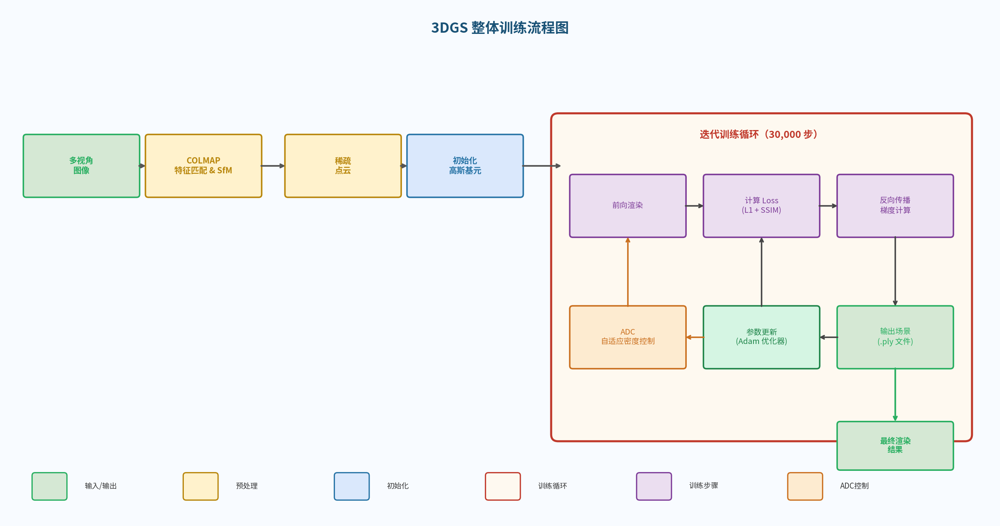
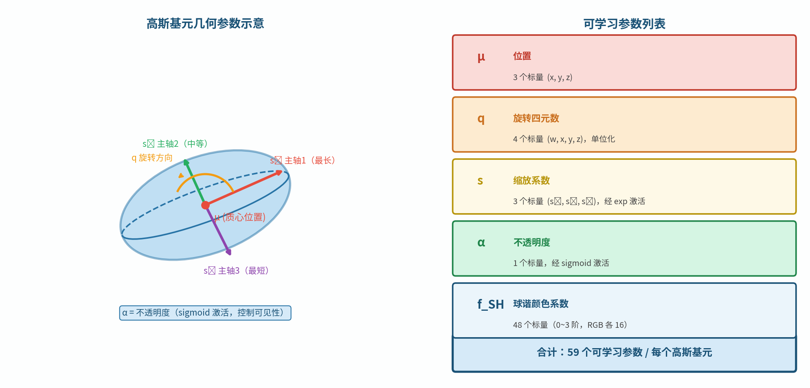
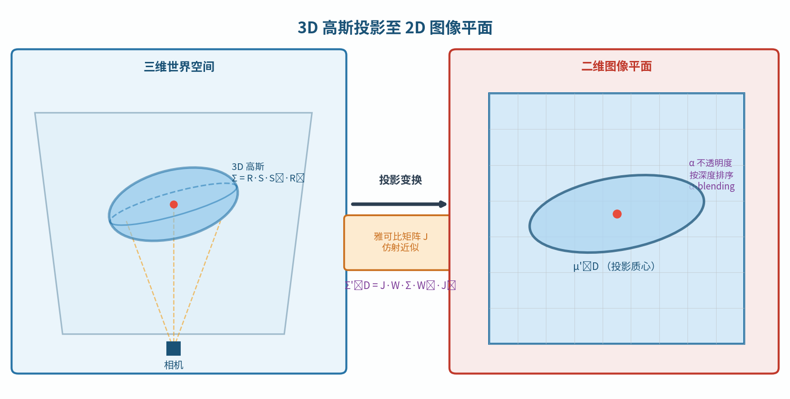
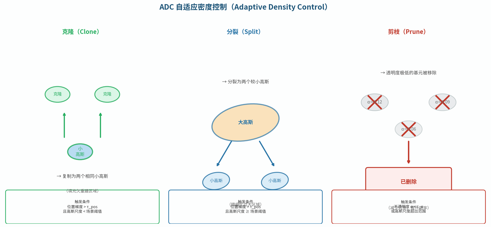
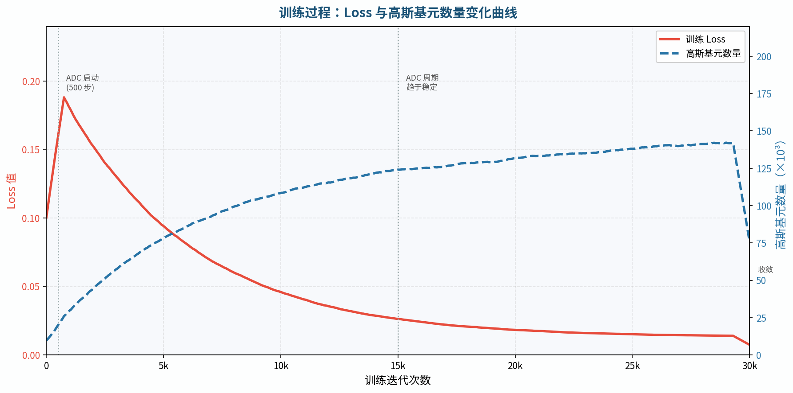
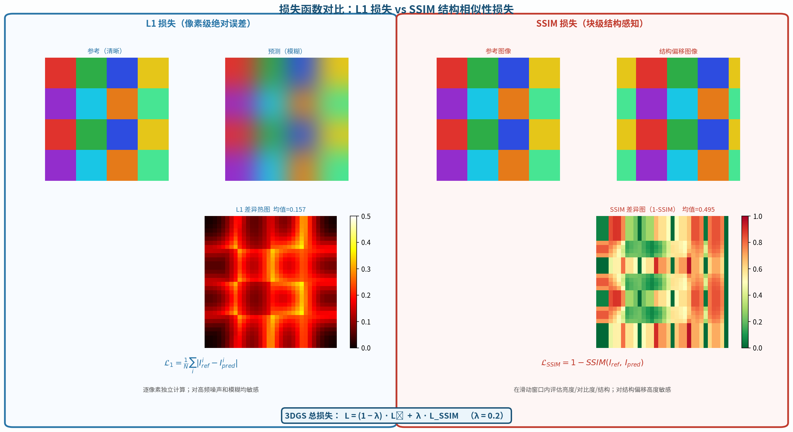

# 第六章：3DGS 核心算法详解

> 3DGS 的全貌：从初始化到训练到渲染，每个环节都拆开讲清楚。

---

## 6.1 整体架构一览

3DGS 的训练流程是一个**迭代优化过程**，整体可以分为以下几个阶段：

```
多视角图像
    │
    ▼ COLMAP SfM
相机位姿 + 稀疏点云
    │
    ▼ 初始化
数百万个三维高斯基元（初始位置来自点云）
    │
    ▼ 迭代训练（30,000步）
    │   ┌─────────────────────────────────────────────┐
    │   │  1. 随机选取一张训练视角图像                   │
    │   │  2. 前向渲染（投影 + 排序 + Alpha合成）        │
    │   │  3. 计算损失 L = L1 + λ·L_SSIM              │
    │   │  4. 反向传播，计算所有高斯参数的梯度            │
    │   │  5. Adam 优化器更新参数                       │
    │   │  6. 每100步：自适应密度控制（ADC）             │
    │   └─────────────────────────────────────────────┘
    │
    ▼ 输出
已训练的高斯场景（.ply文件），可实时渲染
```



**关键数字（Mip-NeRF 360 数据集上的典型值）：**

| 指标 | 数值 |
|------|------|
| 训练时间（RTX 3090） | ~35分钟 |
| 最终高斯数量 | 300-600万 |
| 场景文件大小（.ply） | 300-800 MB |
| 渲染速度（1080p） | 100-150 FPS |
| PSNR（室内场景） | ~31 dB |

**思考题**：3DGS 是"有监督学习"还是"无监督学习"？监督信号是什么？

---

## 6.2 高斯基元的完整参数定义

每个高斯基元存储以下可学习参数：

| 参数 | 维度 | 含义 | 激活函数 |
|------|------|------|---------|
| 位置 $\boldsymbol{\mu}$ | 3 | 高斯中心在世界坐标系的位置 | 无 |
| 旋转（四元数）$q$ | 4 | 高斯椭球的朝向 | 归一化 |
| 缩放 $\mathbf{s}$ | 3 | 三个主轴长度（对数存储） | $\exp$ |
| 不透明度 $o$ | 1 | 渲染时的基础不透明度 | sigmoid |
| 球谐系数 $\mathbf{f}$ | $16\times3$ | RGB三通道的视角相关颜色 | 无（结果用sigmoid） |

**总参数量：** $3+4+3+1+48 = 59$ 个标量/高斯

设有 $N = 300$ 万个高斯：

$$300 \times 10^4 \times 59 \times 4\ \text{字节} \approx 708\ \text{MB}$$

这就是一个典型3DGS场景的存储需求，比NeRF（通常<50MB）大得多。这也是压缩方向（第9章）如此活跃的原因。



**协方差矩阵的重建：**

优化过程中存储四元数 $q$ 和缩放 $\mathbf{s}$，渲染时需要重建协方差矩阵：

$$\Sigma = R \cdot \text{diag}(s_x^2, s_y^2, s_z^2) \cdot R^T$$

其中 $R$ 由四元数 $q$ 计算得到（详见第3章公式）。

**思考题**：3DGS的高斯基元参数在GPU上存储为什么格式？（提示：PyTorch的`nn.Parameter`，连续存储，利于CUDA并行读取）

---

## 6.3 三维高斯投影到二维

这是3DGS的关键数学步骤：将三维高斯椭球投影到相机图像平面，得到二维高斯椭圆。

### 仿射近似（Affine Approximation）

透视投影本身是非线性的（存在除以深度 $Z$ 的操作），但在局部范围内可以用<strong>一阶泰勒展开（雅可比近似）</strong>线性化：

$$\mathbf{x} = \pi(\mathbf{X}) \approx \pi(\boldsymbol{\mu}) + J(\mathbf{X} - \boldsymbol{\mu})$$

其中 $J$ 是投影函数 $\pi$ 在高斯中心 $\boldsymbol{\mu}$ 处的**雅可比矩阵**。

对于针孔相机，相机坐标系下的点 $(X, Y, Z)$ 投影到图像坐标 $(x, y)$ 的雅可比为：

$$J = \begin{bmatrix} \frac{f_x}{Z} & 0 & -\frac{f_x X}{Z^2} \\ 0 & \frac{f_y}{Z} & -\frac{f_y Y}{Z^2} \end{bmatrix} \in \mathbb{R}^{2\times3}$$

### 二维协方差计算

设世界坐标系下的三维协方差为 $\Sigma_W$，相机外参旋转为 $W$（$3\times3$），则二维投影协方差：

$$\Sigma' = J W \Sigma_W W^T J^T \in \mathbb{R}^{2\times2}$$

这是一个 **$2\times3 \cdot 3\times3 \cdot 3\times3 \cdot 3\times3 \cdot 3\times2$** 的矩阵运算，结果是 $2\times2$ 的对称矩阵，完全确定了屏幕上二维高斯椭圆的形状。

### 二维高斯椭圆的渲染

对屏幕上的像素 $\mathbf{p} = (u, v)$，高斯基元的贡献（"影响力"）：

$$\alpha(\mathbf{p}) = o \cdot \exp\!\left(-\frac{1}{2}(\mathbf{p} - \boldsymbol{\mu}')^T (\Sigma')^{-1} (\mathbf{p} - \boldsymbol{\mu}')\right)$$

对 $2\times2$ 矩阵求逆：$(\Sigma')^{-1} = \frac{1}{\det(\Sigma')} \begin{bmatrix} \Sigma'_{22} & -\Sigma'_{12} \\ -\Sigma'_{12} & \Sigma'_{11} \end{bmatrix}$，计算量极小。

**实践中的优化：** 只渲染 $\alpha > \epsilon$（如 $10^{-3}$）的像素，用高斯的边界包围盒裁剪，大量减少无效计算。



**思考题**：雅可比近似在高斯基元很大（覆盖大片视野）时会失效，因为透视变形不再是线性的。3DGS如何处理这种情况？（提示：大高斯会被ADC分裂）

---

## 6.4 Tile-based 光栅化

3DGS 的核心性能来自于专门设计的 **Tile-based CUDA 光栅化器**。

### 预处理阶段

1. **投影**：将所有高斯的三维中心投影到屏幕，计算每个高斯的屏幕包围盒
2. **Tile分配**：将屏幕分成 $16\times16$ 像素的 tile，为每个高斯找出它覆盖的所有 tile
3. **生成排序键**：每个（高斯, tile）对生成一个64位排序键 = `(tile_id << 32 | depth_uint32)`
4. **Radix Sort**：对所有（高斯, tile）对按排序键做**GPU基数排序**，得到每个 tile 内按深度排列的高斯列表

**Radix Sort 的效率：** 时间复杂度 $O(N \cdot b/w)$，其中 $b$ 是位宽（64位），$w$ 是每次处理的位数（通常8位）。对数百万高斯，GPU上只需几毫秒。

### 前向渲染阶段

每个 tile 对应一个 CUDA 线程块（$16\times16 = 256$ 个线程，每线程处理一个像素）。线程块内：

1. 从全局内存加载属于该 tile 的高斯列表（利用**共享内存**批量加载，减少全局内存访问）
2. 每个像素按深度顺序 Alpha 合成，维护：
   - 当前累积颜色 $C$
   - 当前透射率 $T$（初始=1）
   - 终止条件：当 $T < 0.0001$ 时停止（当前像素已几乎不透明）

### 反向传播

反向传播的挑战：Alpha 合成是从前到后的，但反向传播需要从后到前（需要知道后面的 $T$ 值）。

解决方案：**从后向前扫描**（Backward Pass Reverse Scan），或在前向时缓存每个像素最后存活的高斯 ID，从那里向前反推梯度。



**思考题**：为什么共享内存（Shared Memory）比全局显存（Global Memory）快这么多？（提示：延迟差距约100倍。思考L1 Cache和主存的类比）

---

## 6.5 自适应密度控制（ADC）

每训练 **100步**，系统执行一次自适应密度控制（Adaptive Density Control，ADC），动态调整高斯的数量和分布。

### 位置梯度统计

训练过程中，记录每个高斯的**屏幕空间位置梯度均值**：

$$\bar{g}_k = \frac{1}{T} \sum_{t=1}^{T} \left\|\frac{\partial \mathcal{L}}{\partial \boldsymbol{\mu}_k'}\right\|$$

位置梯度大 = 该高斯所在区域细节不够，需要更多基元来覆盖。

### 三种操作

**克隆（Clone）**：适用于**小高斯**（$\max(s_x, s_y, s_z) < \tau_s$）且梯度大的情况。

- 场景：欠重建区域，高斯太少
- 操作：复制一个相同的高斯，两个高斯沿位置梯度方向稍微分开
- 效果：该区域高斯密度增加，细节得到改善

**分裂（Split）**：适用于**大高斯**（$\max(s_x, s_y, s_z) \geq \tau_s$）且梯度大的情况。

- 场景：一个高斯过大，试图覆盖多个不同外观的区域
- 操作：删除原高斯，在原高斯内部随机生成2个新的更小高斯
- 效果：原来一个"大模糊球"分成两个"小精确球"

**剪枝（Prune）**：满足任一条件就删除：

1. 不透明度 $o < \tau_\alpha$（几乎透明，无贡献）
2. 高斯的屏幕投影面积过大（超出场景范围的"幽灵"高斯）

**不透明度重置（Opacity Reset）**：每隔约 3000 步，将所有高斯的不透明度重置为接近0的小值。这迫使真正有用的高斯重新"证明自己"，并给低不透明度高斯一个被剪枝的机会，防止高斯数量无限增长。



**典型高斯数量变化：**

- 初始（来自SfM点云）：~10-20万个高斯
- 7,000步时：约 80-150万
- 30,000步时：约 200-600万

**思考题**：为什么不直接从一开始就用600万个高斯，而是要从少量高斯开始，逐步增加密度？（提示：思考初始化质量和优化稳定性）

---

## 6.6 损失函数设计

3DGS 的训练损失由两项组成：

$$\mathcal{L} = (1 - \lambda) \mathcal{L}_1 + \lambda \mathcal{L}_\text{D-SSIM}$$

其中默认 $\lambda = 0.2$。

### L1 损失

$$\mathcal{L}_1 = \frac{1}{HW} \sum_{i,j} |\hat{I}_{ij} - I_{ij}|$$

逐像素绝对误差。优点：对每个像素平等对待，训练稳定；缺点：对整体结构感知差（见第1章指标讨论）。

### D-SSIM 损失

**D-SSIM = 1 - SSIM**，范围 $[0,1]$，越小越好。

$$\mathcal{L}_\text{D-SSIM} = 1 - \text{SSIM}(\hat{I}, I)$$

SSIM 考虑局部 patch 内的亮度、对比度、结构，对于恢复清晰的边缘和纹理有帮助，是 L1 的有效补充。

**0.2 的权重选择**：原论文通过实验选定，D-SSIM权重过高会导致训练不稳定，过低则结构细节恢复不足。

**为什么不用 LPIPS？** LPIPS 是用神经网络计算的，前向+反向开销很大，在需要快速训练的3DGS中代价太高。L1 + D-SSIM 是性能与质量的工程平衡。



**思考题**：对于一张有强高光（specular highlight）的图像，L1损失会给高光区域分配怎样的梯度？这会影响高斯的球谐系数如何更新？

---

## 6.7 训练超参数解读

3DGS 使用 **Adam 优化器**，不同参数有不同的学习率：

| 参数 | 初始学习率 | 调度方式 | 终止学习率 |
|------|---------|---------|---------|
| 位置 $\boldsymbol{\mu}$ | $1.6\times10^{-4}$ | 指数衰减至 $1.6\times10^{-6}$ | 低 |
| 旋转 $q$ | $1\times10^{-3}$ | 常数 | 常数 |
| 缩放 $\mathbf{s}$ | $5\times10^{-3}$ | 常数 | 常数 |
| 不透明度 $o$ | $5\times10^{-2}$ | 常数 | 常数 |
| 球谐系数 $\mathbf{f}$ | $2.5\times10^{-3}$ | 常数 | 常数 |

**位置学习率指数衰减的原因：**

训练初期，高斯位置变化剧烈（需要从初始点云向正确位置移动）；后期，高斯已大致到位，需要精细调整，过大的学习率会导致震荡。指数衰减让训练从"粗定位"过渡到"精细调整"。

**关键训练节点：**

| 迭代步数 | 发生的事 |
|---------|---------|
| 0 | 从SfM点云初始化所有高斯（位置+默认参数） |
| 1~999 | 只训练颜色（$l=1$球谐），固定位置和形状，让颜色先收敛 |
| 1000+ | 开始优化所有参数；每100步ADC |
| 3000, 6000, 9000 | Opacity Reset |
| 7000 | 保存一次中间检查点 |
| 30000 | 训练结束，保存最终模型 |

**思考题**：为什么训练初期（前1000步）要固定位置和形状，只训练颜色？这样的课程训练（Curriculum Learning）有什么好处？

---

## 本章小结

- 3DGS 整体流程：SfM点云初始化 → 迭代训练（渲染+loss+反向传播+ADC） → 输出高斯场景
- 每个高斯有 59 个参数（位置3、旋转4、缩放3、不透明度1、球谐系数48），数百万高斯存储约数百MB
- 投影：$\Sigma' = JW\Sigma W^T J^T$，三维椭球变二维椭圆，解析计算无采样
- Tile-based 光栅化：16×16 tile + GPU Radix Sort + 共享内存批量处理，是实时性能的关键
- ADC：克隆（小高斯+梯度大）、分裂（大高斯+梯度大）、剪枝（低不透明度），动态调整高斯分布
- 损失：$(1-0.2)\mathcal{L}_1 + 0.2\mathcal{L}_\text{D-SSIM}$，Adam优化器，位置学习率指数衰减

---

## 推荐阅读

- Kerbl et al., "3D Gaussian Splatting for Real-Time Radiance Field Rendering", SIGGRAPH 2023（原始论文，必读）
- 官方仓库 `gaussian_renderer/__init__.py`（前向渲染实现）
- `submodules/diff-gaussian-rasterization/cuda_rasterizer/`（CUDA光栅化核心代码）
- Lassner & Zollhöfer, "Pulsar: Efficient Sphere-based Neural Rendering", CVPR 2021（类似思路的早期工作）

---

*上一章：[第五章：体渲染与 Alpha 合成](chapter5.md)  | 下一章：[第七章：从原始论文到开源代码](chapter7.md)*
