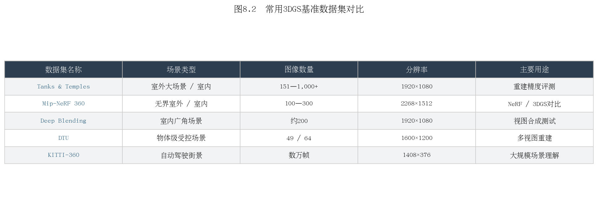
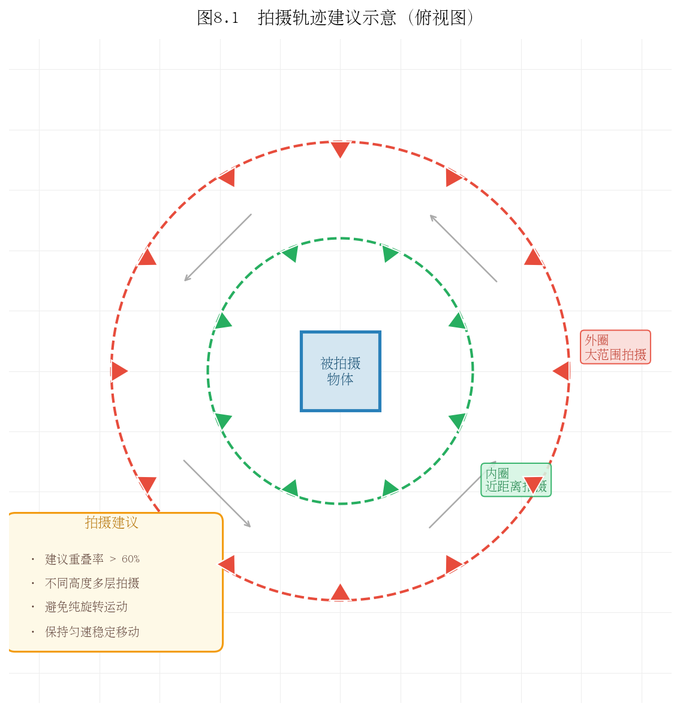
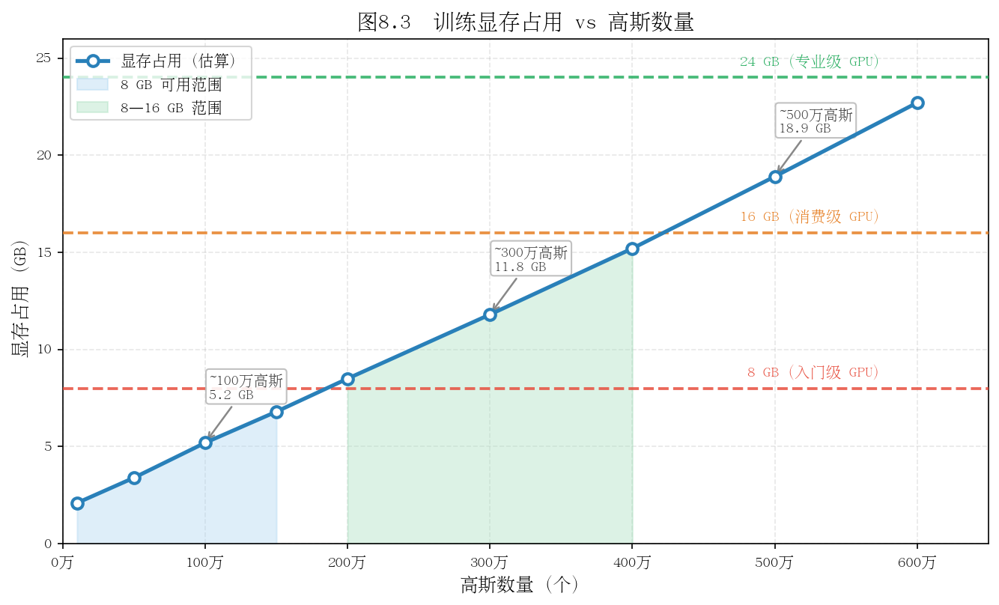
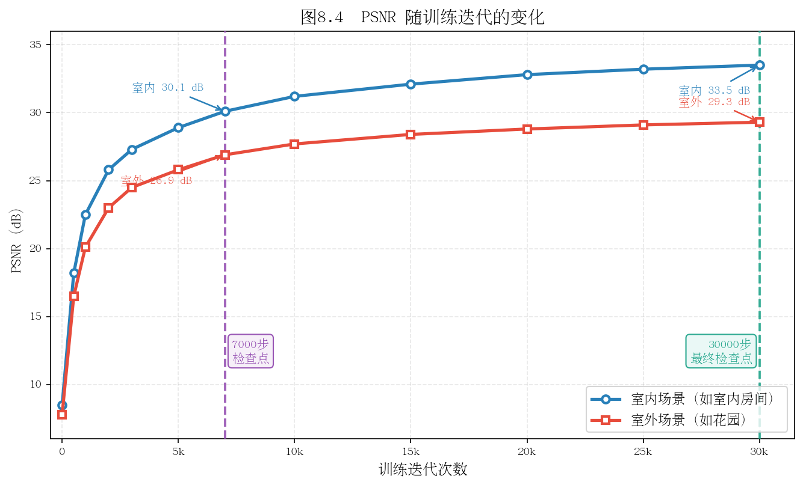

# 第八章：数据准备与训练实战

> 理论到实践的最后一跳：从自己的视频或公开数据集，到一个可实时渲染的3DGS场景。

---

## 8.1 硬件与环境配置

### GPU 显存需求

3DGS 训练是**显存密集型**任务，主要消耗来自：高斯基元参数存储、中间渲染结果缓存、梯度缓冲区。

| 场景规模 | 建议显存 | 典型高斯数量 | 推荐GPU |
|---------|---------|------------|--------|
| 小场景/物体 | 8 GB | <100万 | RTX 3070/4060 Ti |
| 中等室内 | 16 GB | 100-300万 | RTX 3080/4070 Ti |
| 复杂室外 | 24 GB | 300-600万 | RTX 3090/4090 |
| 大场景 | 48 GB+ | >600万 | A6000/H100 |

**显存不足时的降级策略（按效果损失排序）：**

1. 降低图像分辨率：`--resolution 2`（1/4图像像素，最推荐）
2. 降低球谐阶数：`--sh_degree 1`（降低颜色质量但减少参数）
3. 限制高斯上限：`--max_num_splats 1500000`
4. 减小densify频率：`--densification_interval 300`

### CUDA 与依赖版本

3DGS 对版本有严格要求：

| 组件 | 推荐版本 | 说明 |
|------|---------|------|
| CUDA | 11.8 或 12.1 | 避免使用12.3+（部分编译问题） |
| PyTorch | 2.0.x / 2.1.x | 与CUDA版本匹配 |
| Python | 3.8 - 3.10 | 避免3.11+（部分依赖兼容性） |
| GCC | 9 - 11 | CUDA扩展编译需要 |

**推荐安装流程（conda）：**

```bash
conda create -n gs python=3.10 -y
conda activate gs

# 安装匹配CUDA版本的PyTorch
pip install torch torchvision --index-url https://download.pytorch.org/whl/cu118

# 克隆仓库并安装依赖
git clone https://github.com/graphdeco-inria/gaussian-splatting --recursive
cd gaussian-splatting
pip install -r requirements.txt

# 编译CUDA扩展（这一步最容易出错）
pip install submodules/diff-gaussian-rasterization
pip install submodules/simple-knn
```

**验证安装：**

```bash
python -c "import diff_gaussian_rasterization; print('CUDA扩展安装成功')"
```

**Docker 快速启动（推荐）：**

```bash
docker pull nerfstudio/nerfstudio:latest
# 或使用 gsplat 的官方镜像
docker run --gpus all -v /your/data:/data nerfstudio/nerfstudio
```

**思考题**：为什么 3DGS 的 CUDA 扩展需要本地编译，而不能直接 `pip install gaussian-splatting`？编译过程依赖了哪些本机环境信息？

---

## 8.2 公开数据集下载与使用

### Tanks and Temples

经典室外重建基准数据集，包含12个真实室内外场景。

**下载：**

```bash
# 官方下载（需注册）
wget https://storage.googleapis.com/tanks-and-temples/TanksAndTemples.zip
```

场景列表：Truck、Train（室外）；Barn、Caterpillar、Ignatius（室外大场景）；Family（室内）等。

**特点：** 场景复杂，有植被、金属、玻璃，覆盖各种材质挑战；是论文对比中最常用的基准。

### Mip-NeRF 360 数据集

9个场景（5个室外、4个室内），每个场景包含数百张图像，相机绕场景360度环绕。

**下载：**

```bash
# 室外场景（garden, bicycle, bonsai等）
wget http://storage.googleapis.com/gresearch/refraw360/360_v2.zip

# 室内场景（room, kitchen, counter等）  
wget http://storage.googleapis.com/gresearch/refraw360/360_extra_scenes.zip
```

**特点：** 360度环绕拍摄，测试无界场景重建能力；室内/室外差异大，是最全面的NVS基准。

### 数据集对比



| 数据集 | 场景类型 | 图像数量 | 分辨率 | 主要用途 |
|--------|---------|---------|-------|---------|
| Tanks & Temples | 室内外混合 | 150-400 | 1920×1080 | 重建质量评估 |
| Mip-NeRF 360 | 室内+室外 | 100-300 | 1280×720 | NVS全面评估 |
| Deep Blending | 室内 | 50-100 | 1920×1080 | 复杂光照测试 |
| DTU | 物体级别 | 49/64 | 1600×1200 | 精确几何评估 |
| KITTI-360 | 城市街道 | 数万 | 1408×376 | 自动驾驶场景 |

**思考题**：Mip-NeRF 360数据集要求相机360度环绕拍摄。如果只有半圆弧的拍摄角度，另一半没有训练图像，3DGS会如何处理这种"未观测区域"？

---

## 8.3 用自己的视频训练

### 拍摄技巧

好的输入数据是高质量重建的前提。以下是关键拍摄原则：



**必须做的：**
- **重叠率 >60%**：相邻帧之间至少60%的内容相同，确保SfM能找到足够匹配点
- **多角度覆盖**：从不同高度和角度拍摄，避免只有单一水平环绕
- **慢速移动**：保持摄像头稳定，避免运动模糊
- **固定曝光**：关闭自动曝光，防止不同帧亮度差异大

**不要做的：**
- 纯旋转（只转不移）：SfM无法准确估计相机位移
- 急速晃动：导致模糊帧
- 在场景中走动（训练期间）：训练图像中出现人物会导致"幽灵"
- 拍摄纯色区域（白墙、天花板）：COLMAP无法在这些区域找到特征点

### 视频抽帧

```bash
# 用ffmpeg按帧率抽帧（每秒2帧）
ffmpeg -i input_video.mp4 -vf fps=2 images/%04d.jpg

# 如果视频较短，可以抽全帧
ffmpeg -i input_video.mp4 images/%04d.jpg

# 检查图像数量
ls images/ | wc -l
```

<strong>建议图像数量：</strong>100-500张（太少覆盖不足，太多COLMAP很慢）

### COLMAP 自动重建流程

```bash
# 自动模式（推荐，GPU加速）
colmap automatic_reconstructor \
    --workspace_path ./colmap_workspace \
    --image_path ./images \
    --camera_model OPENCV \
    --use_gpu 1 \
    --quality high

# 将结果转换为3DGS期望的格式
cp -r colmap_workspace/sparse ./sparse
```

**检查重建质量：**

```bash
# 查看注册图像数量和重投影误差
colmap model_analyzer --input_path sparse/0
```

输出示例：
```
Cameras: 156
Images: 156 (registered: 153)  ← 注册率 98%，很好
Points: 28456
Mean reprojection error: 0.891 px  ← <1.5px，很好
```

如果注册率 < 80% 或重投影误差 > 2px，建议重新拍摄。

**思考题**：COLMAP 的全自动重建会根据图像数量自动选择特征提取算法（SIFT vs 深度学习特征）。对于光线较暗的室内场景，SIFT 的效果如何？有什么替代方案？

---

## 8.4 训练参数精调

### 不同场景的推荐配置

**室内场景（房间、实验室）：**

```bash
python train.py \
    -s data/room \
    --model_path output/room \
    --iterations 30000 \
    --densify_until_iter 15000 \
    --densify_grad_threshold 0.0002
```

**室外场景（建筑、庭院）：**

```bash
python train.py \
    -s data/garden \
    --model_path output/garden \
    --iterations 30000 \
    --white_background \  # 室外建议白色背景
    --densify_until_iter 15000
```

**小物体（产品、文物）：**

```bash
python train.py \
    -s data/object \
    --model_path output/object \
    --iterations 30000 \
    --sh_degree 3 \
    --densify_grad_threshold 0.0001  # 更激进的密度控制
```

### 快速实验策略

迭代优化时，先用7000步快速验证：

```bash
# 快速验证（约5-10分钟）
python train.py -s data/scene --iterations 7000 --model_path output/quick_test

# 快速查看效果
python render.py -m output/quick_test --skip_train
python metrics.py -m output/quick_test
```

7000步时PSNR通常已达到最终结果的90%，可以快速判断数据质量和参数是否合适。

### 关键超参数影响

| 参数 | 默认值 | 增大效果 | 减小效果 |
|------|-------|---------|---------|
| `densify_grad_threshold` | 0.0002 | 高斯数量减少（欠拟合） | 高斯数量增多（可能过拟合） |
| `opacity_cull_threshold` | 0.005 | 更激进剪枝（高斯数少） | 保留更多"虚弱"高斯 |
| `position_lr_init` | 0.00016 | 高斯移动更快（不稳定） | 移动更慢（收敛慢） |
| `lambda_dssim` | 0.2 | 更注重结构（可能不稳定） | 更注重像素精度 |

**思考题**：`densify_until_iter=15000` 的意思是15000步之后不再做ADC（只做剪枝）。为什么不一直做ADC到训练结束？

---

## 8.5 可视化与结果分析

### SIBR Viewer 实时查看

SIBR (Simple Image-Based Renderer) 是官方提供的实时渲染查看器。

```bash
# 安装
cd SIBR_viewers
cmake . -DCMAKE_BUILD_TYPE=Release
make -j8

# 运行
./SIBR_gaussianViewer_app -m output/room/
```

操作方式：鼠标左键拖动视角，滚轮缩放，右键平移。

**如果没有SIBR，可以用三方可视化工具：**

- **SuperSplat**（网页版）：[supersplat.app](https://supersplat.playcanvas.com/) — 直接拖入 `.ply` 文件在线查看
- **Polycam**：支持 Gaussian Splatting 文件查看
- **Unity/Unreal**：有3DGS插件可直接导入渲染

### Python 轨迹渲染

如果想生成一段"飞行穿越"视频，可以定义相机轨迹并逐帧渲染：

```python
# 定义圆形环绕轨迹，然后渲染每帧
from scene.cameras import Camera
import numpy as np

# 生成环绕轨迹
thetas = np.linspace(0, 2*np.pi, 120)  # 120帧
for i, theta in enumerate(thetas):
    R = rotation_matrix_from_angle(theta)
    t = [np.cos(theta)*2, 0, np.sin(theta)*2]
    cam = Camera(R=R, t=t, FoVx=fov, ...)
    img = render(cam, gaussians, ...)["render"]
    save_image(img, f"frames/{i:04d}.png")

# 合成视频
os.system("ffmpeg -r 24 -i frames/%04d.png output.mp4")
```

### 训练指标监控

在训练时加入 Wandb 记录（需安装 `pip install wandb`）：

```python
# train.py 中已有 TensorBoard 支持，可通过以下命令查看
tensorboard --logdir output/room/
```




**思考题**：训练完成后，你发现场景中某个区域（比如窗帘）效果很差，高斯基元分布稀疏。不重新训练，有什么方法可以改善这个区域的质量？（提示：局部优化、添加更多该区域的训练图像）

---

## 8.6 导出与部署

### PLY 文件格式

训练输出是一个 `.ply` 文件，包含所有高斯基元的参数。PLY是一种简单的3D点云格式，原版 `.ply` 文件中每个点包含 59 个属性（位置、旋转、缩放、不透明度、球谐系数）。

**PLY 文件结构（头部示例）：**

```
ply
format binary_little_endian 1.0
element vertex 3245678       ← 高斯数量
property float x
property float y
property float z
property float nx
...
property float f_dc_0        ← 球谐系数（直流分量）
property float f_dc_1
...
property float f_rest_0      ← 高阶球谐系数
...
property float opacity       ← 不透明度（logit空间）
property float scale_0       ← 缩放（log空间）
...
property float rot_0         ← 旋转四元数
...
end_header
```

### WebGL / 浏览器端部署

[SuperSplat](https://supersplat.playcanvas.com/) 和 [3DGS.live](https://3dgs.live) 等工具支持将 `.ply` 转换为网页可用格式：

1. 在 SuperSplat 中打开 `.ply` 文件，并优化（压缩、剔除）
2. 导出为 `.splat` 格式（更紧凑的自定义格式）
3. 嵌入网页（使用 three.js + gaussian-splatting-three 库）

```html
<!-- 示例：在网页中嵌入3DGS场景 -->
<script src="https://cdn.jsdelivr.net/npm/three@0.155.0/build/three.min.js"></script>
<script src="gaussian-splatting.js"></script>
<script>
  const viewer = new GaussianSplatViewer({
    container: document.getElementById('canvas'),
    splatPath: 'scene.splat'
  });
</script>
```

### 移动端适配

移动端（iOS/Android）性能有限，建议：

1. **压缩高斯数量**：使用 LightGaussian 或 Mini-Splatting 将高斯从300万压缩到50万以内
2. **降低球谐阶数**：从3阶降到1阶，参数量减少75%
3. **使用移动端专用渲染器**：Luma AI 的 iOS SDK，或 GSPLAT.js 的移动端优化版本

### gsplat 库的 Python API

[gsplat](https://github.com/nerfstudio-project/gsplat) 是 Nerfstudio 团队开发的3DGS高性能后端，API更简洁，适合自定义开发：

```python
from gsplat import rasterization

# 核心API：将高斯基元光栅化为图像
renders, alphas, info = rasterization(
    means=gaussians_xyz,        # [N, 3] 高斯位置
    quats=gaussians_quats,      # [N, 4] 旋转四元数
    scales=gaussians_scales,    # [N, 3] 缩放
    opacities=gaussians_opacities, # [N]
    colors=gaussians_colors,    # [N, C]
    viewmats=viewmats,          # [B, 4, 4]
    Ks=Ks,                      # [B, 3, 3]
    width=W, height=H,
)
```

**思考题**：将3DGS部署到网页端时，`.ply` 文件通常需要通过网络下载（可能数百MB），用户体验差。有哪些技术手段可以实现"边下载边渲染"的流式加载？

---

## 本章小结

- 硬件：24GB显存（RTX 4090）可处理大多数场景；显存不足时优先降分辨率
- 公开数据集：Mip-NeRF 360 和 Tanks and Temples 是最常用基准；下载链接见正文
- 自拍视频：重叠率>60%、多角度、固定曝光；ffmpeg抽帧后用COLMAP自动重建
- 训练：7000步快速验证，满意后跑30000步完整训练；不同场景有不同推荐参数
- 部署：SIBR Viewer实时查看；SuperSplat导出网页格式；gsplat提供更简洁的Python API

---

## 推荐阅读

- [nerfstudio 文档](https://docs.nerf.studio/)：包含 Splatfacto（3DGS in nerfstudio）的完整使用说明
- [gsplat 文档](https://docs.gsplat.studio/)：API参考和自定义扩展指南
- COLMAP 官方文档：[colmap.github.io](https://colmap.github.io/)

---

*上一章：[第七章：从原始论文到开源代码](chapter7.md)  | 下一章：[第九章：主流改进方向与前沿论文（截至 2026 年中）](chapter9.md)*
