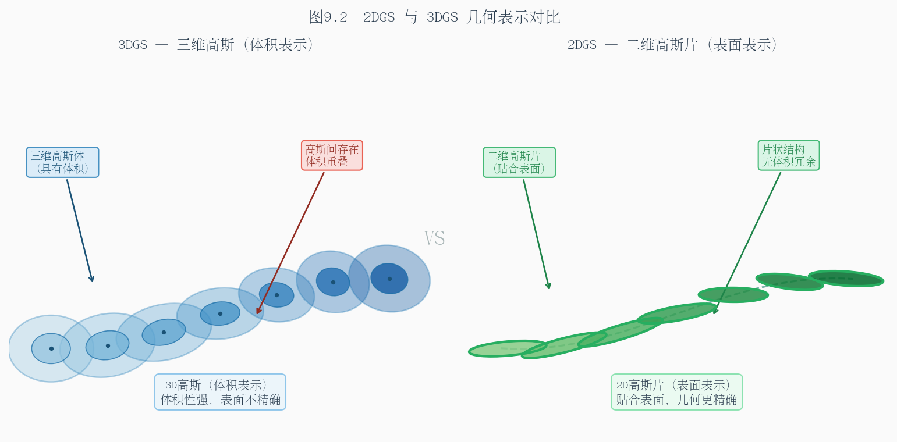
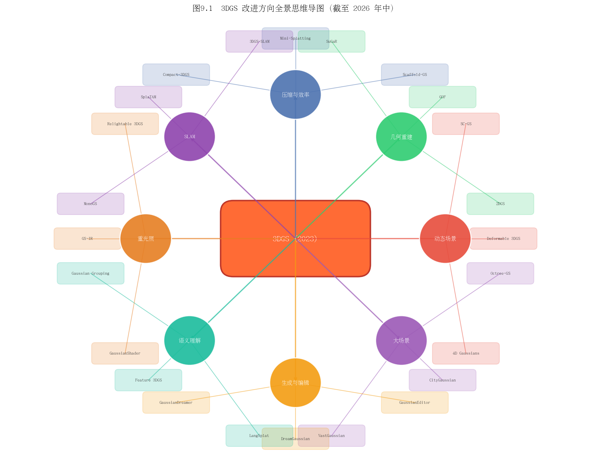
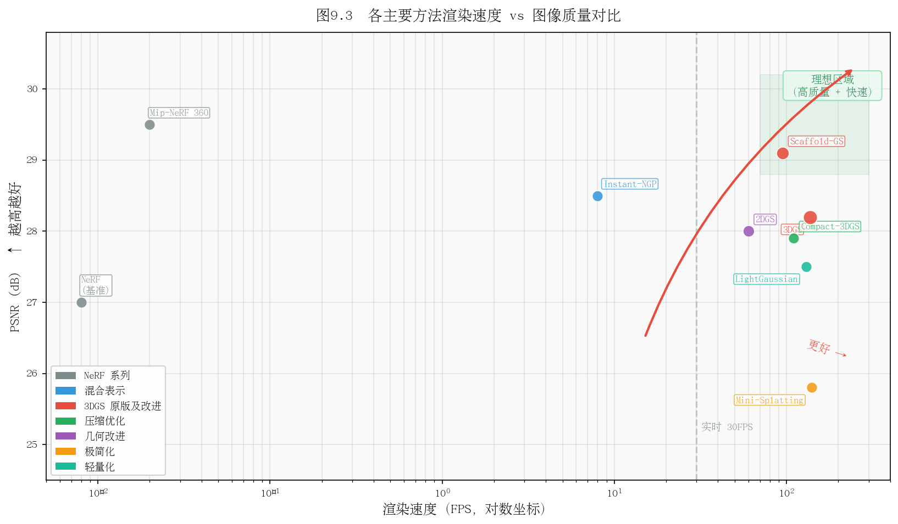
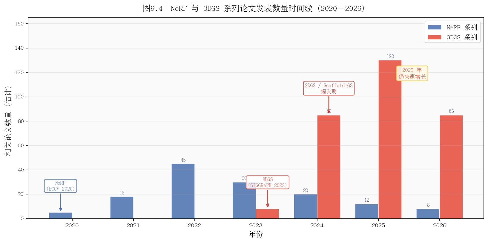

# 第九章：主流改进方向与前沿论文（截至 2026 年中）

> 原版3DGS是起点，不是终点。本章系统梳理2023年至今最重要的改进方向。

---

## 9.1 高效表示与压缩

**问题**：原版3DGS一个场景需要300-800MB，在移动端、网页端或多场景应用中不可接受。

### 代表工作

**Scaffold-GS**（CVPR 2024，[arXiv:2312.00109](https://arxiv.org/abs/2312.00109)）  
核心思想：引入<strong>锚点（Anchor）</strong>作为中间层，每个锚点生成若干**神经高斯（Neural Gaussians）**，通过MLP预测而非直接存储。

- 锚点数量 << 高斯数量，大幅减少存储
- 神经高斯的属性通过特征向量+MLP动态生成，表达能力更强
- PSNR 比原版高约 0.5-1 dB，高斯数量减少 30-50%
- 后续工作 Octree-GS 在 Scaffold-GS 基础上加入八叉树层次结构

**Mini-Splatting**（ECCV 2024，[arXiv:2403.14166](https://arxiv.org/abs/2403.14166)）  
将高斯数量压缩到原版的 **0.2%**（200万→4000个），通过重要性采样选取关键高斯。

**LightGaussian**（NeurIPS 2024，[arXiv:2311.17245](https://arxiv.org/abs/2311.17245)）  
训练后剪枝+蒸馏，在保持80% PSNR的前提下，模型压缩至原版10-20%大小。

**gsplat 库**（持续更新，[github.com/nerfstudio-project/gsplat](https://github.com/nerfstudio-project/gsplat)）  
不是论文而是工程工具：提供比官方实现更高效的CUDA光栅化器（内存占用降低约30%），且 API 更易于二次开发。

| 方法 | 压缩比 | PSNR损失 | 特点 |
|------|-------|---------|------|
| 原版3DGS | 1× | 0 | 基准 |
| LightGaussian | 5-10× | ~0.5 dB | 训练后压缩 |
| Scaffold-GS | 1.5-2× | +0.5 dB（更好） | 训练时优化表示 |
| Mini-Splatting | 500× | ~3 dB | 极限压缩 |

**思考题**：Scaffold-GS 的锚点 + 神经高斯架构，实质上引入了 MLP（类似NeRF）。这是不是在"退化"回NeRF？它和NeRF的根本区别是什么？

---

## 9.2 几何与表面重建

**问题**：3DGS 用体积高斯基元表示场景，从中提取精确的三维表面（网格）很困难。高斯椭球不在表面上，也不贴合表面。

### 代表工作

**2DGS**（SIGGRAPH 2024，[arXiv:2403.17888](https://arxiv.org/abs/2403.17888)）  
将三维高斯**椭球**替换为二维高斯**圆盘（Disk/Surfel）**。二维高斯天然贴合表面，从而：

- 几何重建质量显著提升（Chamfer Distance减少40%以上）
- 网格提取更简单（TSDF融合效果更好）
- 代价：相同场景需要更多高斯基元

**Gaussian Opacity Fields (GOF)**（NeurIPS 2024，[arXiv:2404.10772](https://arxiv.org/abs/2404.10772)）  
在高斯基元上定义连续的不透明度场，允许直接用等值面（Marching Cubes）提取网格，质量接近NeRF级别的网格重建。

**SuGaR**（CVPR 2024，[arXiv:2311.12775](https://arxiv.org/abs/2311.12775)）  
Surface Gaussian Regularization：在3DGS训练中加入正则化项，鼓励高斯基元贴合表面，然后用泊松重建提取网格。

| 方法 | 渲染质量 | 几何质量 | 速度 |
|------|---------|---------|------|
| 原版3DGS | 极高 | 差 | 实时 |
| 2DGS | 高 | 好 | 实时 |
| GOF | 高 | 很好 | 接近实时 |
| SuGaR | 中 | 中 | 慢 |



**思考题**：2DGS 用圆盘替换椭球，意味着每个基元少了一个维度的自由度。这在表示有厚度的半透明物体（如玻璃、头发）时会遇到什么问题？

---

## 9.3 动态场景与视频

**问题**：原版3DGS假设静态场景，无法处理视频中的运动物体。

### 代表工作

**4D Gaussians**（ICLR 2024，[arXiv:2310.17914](https://arxiv.org/abs/2310.17914)）  
在高斯基元中加入**时间维度**：每个高斯有一个随时间变化的变形场（Deformation Field），用小型MLP预测时刻 $t$ 时的位置/形状偏移。

**Deformable 3D Gaussians**（CVPR 2024，[arXiv:2309.13101](https://arxiv.org/abs/2309.13101)）  
类似思路，用MLP预测每个时间步的高斯变形，适合单目视频输入。

**SplatFields**（ECCV 2024，[arXiv:2409.11211](https://arxiv.org/abs/2409.11211)）  
用神经场（Neural Field）作为动态高斯的底层表示，支持更复杂的非刚性变形。

**Dynamic 3DGS**（CVPR 2024，[arXiv:2308.09713](https://arxiv.org/abs/2308.09713)）  
假设场景中刚体运动，每个高斯有独立的运动参数，适合机械、刚体场景。

**2025年方向**：物理驱动的动态高斯（PhysGaussian，加入弹性/塑性变形）、流体高斯（处理液体表面）正在快速发展。

**思考题**：动态3DGS通常需要**密集的多视角视频**（多相机同步）。如果只有单目视频（手机拍摄），重建动态场景会遇到什么根本性困难？（提示：深度歧义和运动歧义同时存在）

---

## 9.4 大场景与城市级重建

**问题**：原版3DGS在大场景中（>100米范围）会出现"高斯爆炸"（远处高斯退化）和内存溢出问题。

### 代表工作

**VastGaussian**（CVPR 2024，[arXiv:2402.17427](https://arxiv.org/abs/2402.17427)）  
将大场景**分块**训练，每块独立优化，最后拼接。加入去天空处理和外观解耦（消除不同图像间的光照差异）。

**CityGaussian**（ECCV 2024，[arXiv:2404.01133](https://arxiv.org/abs/2404.01133)）  
自适应层次化（Level-of-Detail，LOD）高斯表示：远处用少而大的高斯，近处用多而小的高斯。支持城市级别（数平方公里）场景。

**GaussianWorld**（2025，[arXiv:2501.00316](https://arxiv.org/abs/2501.00316)）  
可扩展的开放世界场景表示，支持在线增量扩展（边探索边建图），具有语义感知的场景组织。

**核心技术挑战：**

| 挑战 | 解决思路 |
|------|---------|
| 远处高斯退化 | 球面映射（Sky Box）+ 场景规范化 |
| 内存溢出 | 流式训练（分块加载） |
| 光照不一致 | 外观解耦（Appearance Decoupling） |
| 精细度不足 | LOD层次高斯 |

**思考题**：无人机俯拍城市的图像数据，与地面环绕拍摄的数据，在COLMAP重建时会遇到什么不同的挑战？如何设计拍摄轨迹来覆盖建筑的立面细节？

---

## 9.5 文本/图像驱动生成

**问题**：3DGS需要大量真实图像作为输入。如果没有图像，能否从文本描述或单张图像直接生成3DGS场景？

### 代表工作

**GaussianDreamer**（CVPR 2024，[arXiv:2312.14231](https://arxiv.org/abs/2312.14231)）  
用文本驱动的扩散模型（如 Stable Diffusion 3D）生成初始点云，然后用3DGS优化渲染质量。"从文字到可渲染3D场景"，约15分钟生成。

**DreamGaussian**（ICLR 2024，[arXiv:2309.16653](https://arxiv.org/abs/2309.16653)）  
从**单张图像**生成3DGS场景：先用diffusion model做360度图像补全，再用3DGS优化。约2分钟完成。

**GaussianEditor**（CVPR 2024，[arXiv:2311.14521](https://arxiv.org/abs/2311.14521)）  
文本驱动的场景编辑：输入"把椅子变成木质风格"，系统自动找到对应高斯并修改。

**Instruct-GS2GS**（ECCV 2024，[arXiv:2403.14302](https://arxiv.org/abs/2403.14302)）  
基于自然语言指令的3DGS场景编辑，利用InstructPix2Pix做图像级别编辑后反向优化高斯参数。

**思考题**：GaussianDreamer 生成的场景在"外观多样性"上与基于真实图像训练的3DGS有什么本质差异？生成内容为什么难以完全逼真？

---

## 9.6 语义理解与场景分析

**问题**：原版3DGS只有外观信息（颜色），没有语义信息（这是椅子、那是桌子）。加入语义信息可以支持场景理解、目标检测、虚拟编辑等任务。

### 代表工作

**Gaussian Grouping**（CVPR 2024，[arXiv:2312.00732](https://arxiv.org/abs/2312.00732)）  
无需额外标注，通过聚类3DGS高斯基元实现**实例级别的语义分割**。输入 Segment Anything Model (SAM) 的2D分割结果，在3D中一致性地传播到高斯层面，实现任意物体的3D选中和编辑。

**Feature 3DGS**（CVPR 2024，[arXiv:2312.03203](https://arxiv.org/abs/2312.03203)）  
将2D基础模型（CLIP、DINO、SAM）的**特征向量蒸馏**到3DGS高斯基元中，实现开放词汇查询（"找出所有椅子"）。

**LangSplat**（CVPR 2024，[arXiv:2312.16084](https://arxiv.org/abs/2312.16084)）  
将CLIP语言特征嵌入3DGS，支持自然语言驱动的3D目标定位。

**OpenGaussian**（2024，[arXiv:2406.11421](https://arxiv.org/abs/2406.11421)）  
开放词汇3D场景理解，支持任意语言查询定位三维物体。

**思考题**：Feature 3DGS 把2D特征蒸馏到3D高斯，蒸馏时如何处理同一个高斯从不同视角看到的特征不一致问题？（提示：类比球谐系数处理视角相关颜色的方式）

---

## 9.7 光照分解与重光照

**问题**：原版3DGS将光照"烘焙"进球谐系数，更换光照环境需要重新训练。重光照（Relighting）是指在新的光照环境下渲染原场景。

### 代表工作

**Relightable 3DGS**（NeurIPS 2024，[arXiv:2311.09897](https://arxiv.org/abs/2311.09897)）  
将每个高斯的外观分解为：漫反射颜色（Diffuse）、镜面反射参数（BRDF）、可见度（Visibility）。训练后可以在任意新光照下重新渲染。

**GaussianShader**（2024，[arXiv:2311.17977](https://arxiv.org/abs/2311.17977)）  
为3DGS加入可学习的着色器，建模高光、法线、粗糙度等PBR（基于物理的渲染）参数。

**GS-IR**（CVPR 2024，[arXiv:2311.16473](https://arxiv.org/abs/2311.16473)）  
从3DGS恢复材质（BRDF）和光照（环境贴图），支持重光照和材质编辑。

**2025年趋势：** 结合神经SDF和3DGS的混合方法，在高保真渲染和精确材质估计之间取得更好的平衡。

**思考题**：在有强烈镜面反射的场景（如不锈钢水壶），重光照时需要考虑**互反射（Inter-reflection）**（物体间相互反射光）。现有的重光照3DGS方法能处理这种效果吗？

---

## 9.8 人体与Avatar建模

**问题**：人体是视频生成、VR/AR、虚拟试穿最重要的对象。用3DGS建模可驱动的人体模型是热点方向。

### 代表工作

**GaussianAvatars**（CVPR 2024，[arXiv:2312.02069](https://arxiv.org/abs/2312.02069)）  
将高斯基元**绑定到FLAME人脸模型**上，通过驱动FLAME参数实现面部表情和头部姿态控制。高精度、实时渲染的人脸重建。

**SplattingAvatar**（CVPR 2024，[arXiv:2403.05087](https://arxiv.org/abs/2403.05087)）  
将高斯基元绑定到SMPL人体模型上，实现全身可驱动的人体Avatar。

**Human Gaussian Splatting**（CVPR 2024，[arXiv:2311.17113](https://arxiv.org/abs/2311.17113)）  
单目视频重建可动画的人体高斯模型，不需要多摄像机系统。

**GPS-Gaussian**（CVPR 2024，[arXiv:2312.02155](https://arxiv.org/abs/2312.02155)）  
实时生成任意姿态下的人体Gaussian Splatting，支持实时传输和渲染。

**思考题**：FLAME/SMPL模型是预建的参数化人体/人脸模型，有固定的拓扑结构。将高斯绑定到这类模型上，会在什么情况下失败？（提示：考虑衣物、头发、手持物品等非模型元素）

---

## 9.9 自动驾驶仿真

**问题**：自动驾驶的感知模型需要大量训练数据，真实采集成本高。用3DGS重建真实驾驶场景，可以便宜地生成多样化训练数据。

### 代表工作

**HUGSIM**（arXiv 2025，[arXiv:2501.12320](https://arxiv.org/abs/2501.12320)）  
统一的闭环自动驾驶仿真框架：重建驾驶场景，支持相机、LiDAR等多传感器模拟，支持闭环测试（仿真中控制车辆并实时渲染新视角）。

**EmerNeRF**（ICLR 2024，[arXiv:2311.02077](https://arxiv.org/abs/2311.02077)）  
将驾驶场景分解为静态背景（3DGS）和动态前景（时序高斯），并加入LiDAR深度监督。

**DrivingGaussian**（CVPR 2024，[arXiv:2312.07920](https://arxiv.org/abs/2312.07920)）  
专为驾驶场景设计的复合高斯表示：增量式重建沿途场景，支持动态物体的独立建模。

**Street Gaussians**（ECCV 2024，[arXiv:2401.01339](https://arxiv.org/abs/2401.01339)）  
将驾驶场景中的动态车辆用**独立的3DGS模型**表示，实现动态目标的精确重建和自由控制。

**工业落地进展（2025）：**
- Wayve、Waymo等公司已将3DGS类方法用于感知训练数据增强
- 传感器级别真实性（LiDAR点云统计一致性）是当前主要评测维度

**思考题**：在闭环仿真中，当自动驾驶车辆偏离原始录制轨迹时，3DGS需要渲染从**训练时未曾见过**的视角拍摄的场景。这种"外推渲染"会出现什么问题？如何缓解？

---

## 9.10 SLAM 与实时建图

**问题**：传统3DGS需要预先收集所有图像（离线），无法支持机器人实时建图（SLAM）场景中的在线、增量建图需求。

### 代表工作

**3DGS-SLAM**（CVPR 2024，[arXiv:2312.02126](https://arxiv.org/abs/2312.02126)）  
将3DGS场景表示与实时SLAM系统结合：相机位姿跟踪（Tracking）和场景建图（Mapping）交替进行，实现实时、增量式的3DGS建图。

**SplaTAM**（CVPR 2024，[arXiv:2312.02126](https://arxiv.org/abs/2312.02126)）  
简洁优雅的高斯SLAM实现，将整个SLAM流程简化为高斯基元的在线优化问题，在TUM RGB-D数据集上达到sota。

**MonoGS**（CVPR 2024，[arXiv:2405.06241](https://arxiv.org/abs/2405.06241)）  
**单目**（仅RGB，无深度传感器）的高斯SLAM，在未知相机位姿下实时建图，是最接近实用部署的方案。

**在线建图的工程挑战：**

| 挑战 | 说明 |
|------|------|
| 闭环检测 | 重新访问已建图区域时需要纠正累积误差 |
| 实时性 | Tracking和Mapping需在33ms内完成 |
| 内存管理 | 无限增长的高斯需要有上限策略 |
| 一致性 | 高斯更新时不能破坏已建图区域的质量 |

**思考题**：3DGS-SLAM 在实时建图时，当相机遇到之前见过的区域（闭环），高斯的位置和形状需要全局调整（Bundle Adjustment）。这与原版3DGS的离线BA有什么不同？在线BA面临哪些挑战？

---

## 9.11 阅读前沿论文的方法论

### 检索工具

- **arXiv cs.CV**：[arxiv.org/list/cs.CV/recent](https://arxiv.org/list/cs.CV/recent)，每天更新，是最快看到新工作的地方
- **Semantic Scholar**：[semanticscholar.org](https://www.semanticscholar.org/)，支持引用关系搜索和相关论文推荐
- **Papers With Code**：[paperswithcode.com](https://paperswithcode.com/)，附带代码链接和benchmark排行榜
- **Awesome-3D-Gaussian-Splatting**：[github.com/MrNeRF/awesome-3D-gaussian-splatting](https://github.com/MrNeRF/awesome-3D-gaussian-splatting)，社区维护的3DGS论文列表

### 15分钟快速判断论文价值

1. **摘要（2分钟）**：解决了什么问题？贡献是什么？结果超过SOTA多少？
2. **图1和实验表格（5分钟）**：效果图是否直观？定量数字是否比较公平？有没有消融实验？
3. **方法核心图（5分钟）**：架构图是否清晰？新颖性体现在哪里？
4. **限制和未来工作（3分钟）**：作者自己承认的局限是什么？这说明什么没解决？

### 跟踪2025-2026新进展的工作流

**每周检索命令（在arXiv搜索）：**

```
搜索词：gaussian splatting + 年份
过滤：cs.CV + 最近7天
排序：相关性
```

推荐订阅 [Daily Papers](https://huggingface.co/papers)（Hugging Face）或 [arxiv-daily](https://github.com/Vincentqyw/cv-arxiv-daily)。

**判断"值得精读"的快速筛选标准：**
- 被大组/知名实验室提交（INRIA、Stanford、CMU、UCB、腾讯AI、字节、商汤等）
- 在顶会（CVPR/ICCV/ECCV/SIGGRAPH/NeurIPS/ICLR）录用
- 代码已开源（代码开源=作者对结果有信心）
- 在多个数据集上都有改善（不是只在一个特殊数据集上好）





**思考题**：3DGS领域每周都有数篇新论文。如何判断一篇新论文的贡献是"真正的改进"还是"刷数字"（只在特定设置下有效，无法泛化）？

---

## 本章小结

截至2026年中，3DGS已从单一方法演变为完整的方向生态：

| 方向 | 代表方法 | 成熟度 |
|------|---------|-------|
| 压缩与效率 | Scaffold-GS, gsplat | 成熟，已有工程部署 |
| 表面重建 | 2DGS, GOF | 较成熟，可用于测量 |
| 动态场景 | 4D Gaussians, Deformable | 研究阶段，效果有限 |
| 大场景 | VastGaussian, CityGaussian | 初步成熟 |
| 语义理解 | Gaussian Grouping, Feature 3DGS | 较成熟 |
| 重光照 | Relightable 3DGS | 研究阶段 |
| 自动驾驶 | HUGSIM, Street Gaussians | 工业落地中 |
| SLAM | 3DGS-SLAM, SplaTAM | 实验室级别 |

---

## 推荐阅读

- [Awesome-3D-Gaussian-Splatting](https://github.com/MrNeRF/awesome-3D-gaussian-splatting) — 持续维护的论文列表，新论文优先在此出现
- [3DGS Surveys](https://arxiv.org/abs/2401.03890) — Gaussian Splatting综述论文（2024）
- [Papers With Code - Gaussian Splatting](https://paperswithcode.com/task/gaussian-splatting) — 实时benchmark排行榜

---

*上一章：[第八章：数据准备与训练实战](chapter8.md)  | 下一章：[第十章：成为贡献者——如何迭代改进系统](chapter10.md)*
